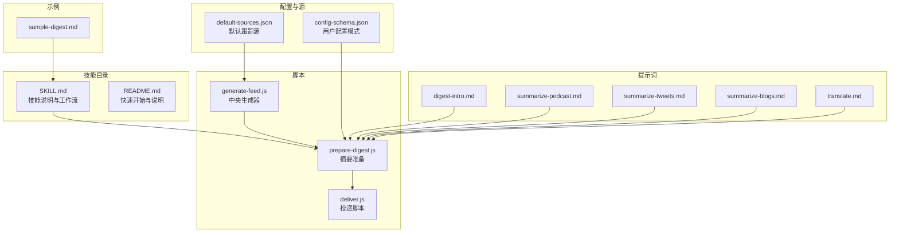
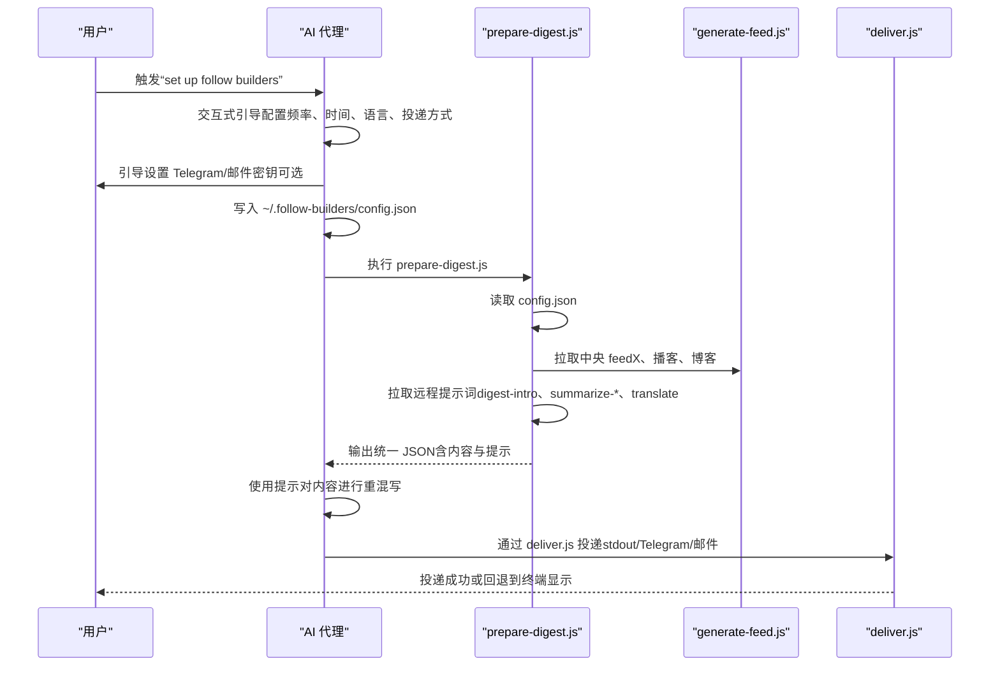
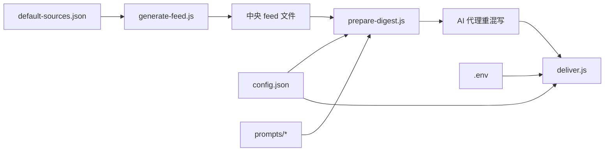

# 快速开始

<cite>
**本文引用的文件**
- [README.md](file://README.md)
- [SKILL.md](file://SKILL.md)
- [package.json](file://scripts/package.json)
- [config-schema.json](file://config/config-schema.json)
- [default-sources.json](file://config/default-sources.json)
- [generate-feed.js](file://scripts/generate-feed.js)
- [prepare-digest.js](file://scripts/prepare-digest.js)
- [deliver.js](file://scripts/deliver.js)
- [summarize-blogs.md](file://prompts/summarize-blogs.md)
- [summarize-podcast.md](file://prompts/summarize-podcast.md)
- [summarize-tweets.md](file://prompts/summarize-tweets.md)
- [digest-intro.md](file://prompts/digest-intro.md)
- [translate.md](file://prompts/translate.md)
- [sample-digest.md](file://examples/sample-digest.md)
</cite>

## 目录
1. [简介](#简介)
2. [项目结构](#项目结构)
3. [核心组件](#核心组件)
4. [架构总览](#架构总览)
5. [详细组件分析](#详细组件分析)
6. [依赖关系分析](#依赖关系分析)
7. [性能与可用性建议](#性能与可用性建议)
8. [故障排查指南](#故障排查指南)
9. [结论](#结论)
10. [附录：命令与配置清单](#附录命令与配置清单)

## 简介
Follow Builders 是一个由 AI 驱动的摘要技能，自动追踪 AI 领域的顶级“建造者”（研究者、创始人、产品经理、工程师），从 X/Twitter、YouTube 播客以及官方博客中抓取最新内容，生成每日或每周的可读摘要，并通过你偏好的消息渠道投递（如 Telegram、邮件或在聊天中直接显示）。你无需任何 API 密钥即可使用核心功能；仅当你选择 Telegram 或邮件投递时才需要本地配置密钥。

本快速开始指南将带你：
- 在 OpenClaw 和 Claude Code 中安装技能
- 完成环境准备（Node.js 与 npm 依赖）
- 通过 AI 代理进行交互式首次配置
- 运行第一个摘要
- 常见问题与解决方案

## 项目结构
该项目采用“技能 + 脚本 + 提示词 + 配置”的分层组织方式：
- 技能描述与工作流：SKILL.md
- 核心脚本：scripts/ 下的 generate-feed.js、prepare-digest.js、deliver.js
- 配置与默认源：config/ 下的 config-schema.json、default-sources.json
- 提示词：prompts/ 下的各类摘要与翻译提示
- 示例输出：examples/sample-digest.md
- 包管理与脚本入口：scripts/package.json

图表来源
- [SKILL.md:1-467](file://SKILL.md#L1-L467)
- [README.md:1-132](file://README.md#L1-L132)
- [generate-feed.js:1-1100](file://scripts/generate-feed.js#L1-L1100)
- [prepare-digest.js:1-166](file://scripts/prepare-digest.js#L1-L166)
- [deliver.js:1-218](file://scripts/deliver.js#L1-L218)
- [config-schema.json:1-66](file://config/config-schema.json#L1-L66)
- [default-sources.json:1-78](file://config/default-sources.json#L1-L78)
- [digest-intro.md:1-60](file://prompts/digest-intro.md#L1-L60)
- [summarize-podcast.md:1-18](file://prompts/summarize-podcast.md#L1-L18)
- [summarize-tweets.md:1-22](file://prompts/summarize-tweets.md#L1-L22)
- [summarize-blogs.md:1-19](file://prompts/summarize-blogs.md#L1-L19)
- [translate.md:1-19](file://prompts/translate.md#L1-L19)
- [sample-digest.md:1-61](file://examples/sample-digest.md#L1-L61)

章节来源
- [README.md:85-119](file://README.md#L85-L119)
- [SKILL.md:18-30](file://SKILL.md#L18-L30)

## 核心组件
- 中央生成器（generate-feed.js）：定时抓取 X/Twitter、播客 RSS、博客页面，去重并生成 feed 文件，供后续消费。
- 摘要准备（prepare-digest.js）：拉取中央 feed、远程提示词，合并用户配置，输出统一 JSON 给 LLM。
- 投递（deliver.js）：根据配置与 .env，将摘要发送到 Telegram、邮件或 stdout。
- 配置模式（config-schema.json）：定义用户配置字段、默认值与枚举。
- 默认源（default-sources.json）：内置播客、博客与 X 账号列表。
- 提示词（prompts/*）：控制摘要风格、格式与翻译策略。

章节来源
- [generate-feed.js:1-1100](file://scripts/generate-feed.js#L1-L1100)
- [prepare-digest.js:1-166](file://scripts/prepare-digest.js#L1-L166)
- [deliver.js:1-218](file://scripts/deliver.js#L1-L218)
- [config-schema.json:1-66](file://config/config-schema.json#L1-L66)
- [default-sources.json:1-78](file://config/default-sources.json#L1-L78)
- [digest-intro.md:1-60](file://prompts/digest-intro.md#L1-L60)
- [summarize-podcast.md:1-18](file://prompts/summarize-podcast.md#L1-L18)
- [summarize-tweets.md:1-22](file://prompts/summarize-tweets.md#L1-L22)
- [summarize-blogs.md:1-19](file://prompts/summarize-blogs.md#L1-L19)
- [translate.md:1-19](file://prompts/translate.md#L1-L19)

## 架构总览
Follow Builders 的运行链路分为“数据采集—摘要准备—投递”三层，均由脚本驱动，AI 代理负责交互式配置与最终的“重混写”（remix）环节。

图表来源
- [SKILL.md:36-304](file://SKILL.md#L36-L304)
- [prepare-digest.js:58-156](file://scripts/prepare-digest.js#L58-L156)
- [deliver.js:154-215](file://scripts/deliver.js#L154-L215)

## 详细组件分析

### 安装与环境准备
- 平台支持：OpenClaw 与 Claude Code（及其他非持久化代理）
- Node.js 与 npm：脚本以 ES Module 方式编写，需 Node.js 支持；在 scripts/ 目录下执行 npm install 安装依赖。
- OpenClaw 安装：可通过 ClawHub 安装，或手动克隆到 ~/skills/follow-builders，再进入 scripts 执行 npm install。
- Claude Code 安装：克隆到 ~/.claude/skills/follow-builders，再进入 scripts 执行 npm install。

章节来源
- [README.md:87-101](file://README.md#L87-L101)
- [package.json:1-15](file://scripts/package.json#L1-L15)

### 首次配置（交互式设置）
- 触发方式：在 OpenClaw 或 Claude Code 中输入“set up follow builders”，或调用 /follow-builders。
- 代理会依次询问：
  - 投递频率（每日/每周）与时间（含时区）
  - 语言偏好（英语/中文/双语）
  - 投递方式（OpenClaw 自动投递 stdout；非持久化代理可选 Telegram/邮件/按需）
- 若选择 Telegram/邮件，代理会指导你创建机器人或获取 API Key，并将密钥写入 ~/.follow-builders/.env。
- 配置写入 ~/.follow-builders/config.json，包含平台、语言、时区、频率、投递时间、每周日期（如适用）、投递方法及目标信息等。

章节来源
- [SKILL.md:36-186](file://SKILL.md#L36-L186)
- [config-schema.json:1-66](file://config/config-schema.json#L1-L66)

### 投递与 Cron 设置
- OpenClaw：检测当前通道与目标 ID，使用 openclaw cron add 创建定时任务，避免使用 --channel last，确保明确指定通道与目标。
- 非持久化代理（Claude Code/Cursor 等）：使用系统 crontab，将 prepare-digest.js 的输出直接管道给 deliver.js，实现自动投递。
- 验证：先列出任务，再立即运行一次验证，查看最近一次运行日志定位问题。

章节来源
- [SKILL.md:188-278](file://SKILL.md#L188-L278)

### 数据流与摘要生成
- 数据来源：中央 feed（X/Twitter、播客、博客）由 generate-feed.js 定时生成，prepare-digest.js 拉取并合并用户配置与提示词。
- 内容处理：LLM 仅基于 JSON 中的内容进行重混写，严格遵循提示词规则，不得虚构链接或内容。
- 语言与翻译：根据 config.language 选择英文、中文或双语；双语模式下按段落交错输出。
- 投递：deliver.js 根据配置与 .env 决定 stdout、Telegram 或邮件投递。

章节来源
- [SKILL.md:307-410](file://SKILL.md#L307-L410)
- [prepare-digest.js:58-156](file://scripts/prepare-digest.js#L58-L156)
- [deliver.js:154-215](file://scripts/deliver.js#L154-L215)

### 提示词与定制
- 可通过对话调整摘要风格（更简洁/更深入/更口语化等），代理会更新 ~/.follow-builders/prompts/ 下的对应文件。
- 直接编辑 prompts/ 下的文件也可生效，但建议通过对话方式，以便下次中央更新不会覆盖你的个性化。

章节来源
- [SKILL.md:49-66](file://SKILL.md#L49-L66)
- [digest-intro.md:1-60](file://prompts/digest-intro.md#L1-L60)
- [summarize-podcast.md:1-18](file://prompts/summarize-podcast.md#L1-L18)
- [summarize-tweets.md:1-22](file://prompts/summarize-tweets.md#L1-L22)
- [summarize-blogs.md:1-19](file://prompts/summarize-blogs.md#L1-L19)
- [translate.md:1-19](file://prompts/translate.md#L1-L19)

## 依赖关系分析
- generate-feed.js 依赖 default-sources.json 获取源列表，使用外部服务（X API、pod2txt、YouTube Atom/网页）抓取内容。
- prepare-digest.js 依赖 config.json 与远程提示词，输出统一 JSON。
- deliver.js 依赖 config.json 与 .env，按 method 分派投递逻辑。
- package.json 定义脚本入口与依赖（dotenv、proper-lockfile）。

图表来源
- [default-sources.json:1-78](file://config/default-sources.json#L1-L78)
- [generate-feed.js:1-1100](file://scripts/generate-feed.js#L1-L1100)
- [prepare-digest.js:1-166](file://scripts/prepare-digest.js#L1-L166)
- [deliver.js:1-218](file://scripts/deliver.js#L1-L218)
- [package.json:1-15](file://scripts/package.json#L1-L15)

章节来源
- [package.json:1-15](file://scripts/package.json#L1-L15)
- [config-schema.json:1-66](file://config/config-schema.json#L1-L66)

## 性能与可用性建议
- 优先使用 OpenClaw：具备稳定的通道系统与 cron 管理，投递更可靠。
- 非持久化代理：建议开启 Telegram/邮件投递，否则只能按需触发 /ai 获取摘要。
- 保持网络稳定：prepare-digest.js 与 deliver.js 均依赖网络访问，失败时检查网络与 DNS。
- 合理设置频率与时区：避免过于频繁导致资源浪费，或过于稀疏错过重要更新。

[本节为通用建议，不直接分析具体文件]

## 故障排查指南
- 无法连接网络
  - 现象：prepare-digest.js 输出错误或无 JSON。
  - 处理：检查网络连通性，稍后重试。
- Telegram 投递失败
  - 现象：deliver.js 报错，或 Telegram 返回解析错误。
  - 处理：确认 .env 中 TELEGRAM_BOT_TOKEN 与 config.json 中 chatId 正确；若 Markdown 解析报错，脚本会自动降级为普通文本发送。
- 邮件投递失败
  - 现象：deliver.js 报错，Resend 返回错误。
  - 处理：确认 .env 中 RESEND_API_KEY 与 config.json 中 email 正确；检查邮箱地址有效性。
- Cron 未生效
  - 现象：OpenClaw 报“需要指定通道/目标”或“缺少 agent”。
  - 处理：使用 openclaw cron add 明确指定 --channel 与 --to；必要时添加 --agent；先 openclaw cron list 再 openclaw cron run <jobId> 验证。
- 内容为空
  - 现象：stats 中 podcastEpisodes 与 xBuilders 均为 0。
  - 处理：等待中央 feed 更新或稍后再试；检查 default-sources.json 是否被正确加载。

章节来源
- [deliver.js:154-215](file://scripts/deliver.js#L154-L215)
- [SKILL.md:257-262](file://SKILL.md#L257-L262)
- [prepare-digest.js:82-84](file://scripts/prepare-digest.js#L82-L84)

## 结论
Follow Builders 的设计目标是“零门槛、低维护、高价值”。你只需在 AI 代理中完成一次交互式设置，即可获得每日或每周的高质量摘要。若你希望更快上手，建议：
- 使用 OpenClaw 并选择 stdout 投递，立即体验完整摘要流程；
- 如需自动投递，再逐步配置 Telegram/邮件；
- 通过对话微调摘要风格，或在 prompts/ 下进行深度定制。

[本节为总结性内容，不直接分析具体文件]

## 附录：命令与配置清单

- 安装（OpenClaw）
  - 从 ClawHub 安装：clawhub install follow-builders
  - 或手动克隆：git clone https://github.com/zarazhangrui/follow-builders.git ~/skills/follow-builders
  - 进入 scripts 并安装依赖：cd ~/skills/follow-builders/scripts && npm install

- 安装（Claude Code）
  - 克隆到用户目录：git clone https://github.com/zarazhangrui/follow-builders.git ~/.claude/skills/follow-builders
  - 进入 scripts 并安装依赖：cd ~/.claude/skills/follow-builders/scripts && npm install

- 首次配置
  - 在代理中输入“set up follow builders”或调用 /follow-builders
  - 按提示选择频率、时间、语言与投递方式
  - 若选择 Telegram/邮件，按代理指引创建机器人/获取 API Key，并写入 ~/.follow-builders/.env

- 运行第一个摘要
  - 立即触发：在代理中输入“/ai”或调用 /ai
  - 或等待 Cron 定时任务执行

- 关键配置项（config.json）
  - platform：openclaw 或 other
  - language：en、zh、bilingual
  - timezone：IANA 时区字符串
  - frequency：daily 或 weekly
  - deliveryTime：HH:MM（24小时制）
  - weeklyDay：周一至周日（仅 weekly 生效）
  - delivery.method：stdout、telegram、email
  - delivery.chatId：Telegram 目标 ID（仅 telegram）
  - delivery.email：收件邮箱（仅 email）

- 常用脚本
  - generate-feed：生成中央 feed（由 GitHub Actions 定时运行）
  - prepare-digest：准备摘要 JSON（拉取 feed 与提示词）
  - deliver：根据配置投递摘要

- 示例输出参考
  - examples/sample-digest.md 展示了最终摘要的排版与要点组织方式

章节来源
- [README.md:87-101](file://README.md#L87-L101)
- [SKILL.md:36-186](file://SKILL.md#L36-L186)
- [config-schema.json:1-66](file://config/config-schema.json#L1-L66)
- [package.json:6-9](file://scripts/package.json#L6-L9)
- [sample-digest.md:1-61](file://examples/sample-digest.md#L1-L61)