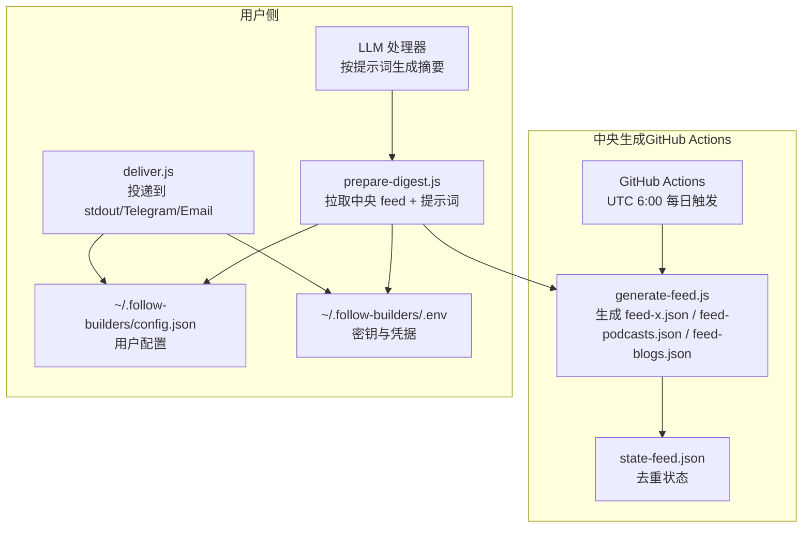
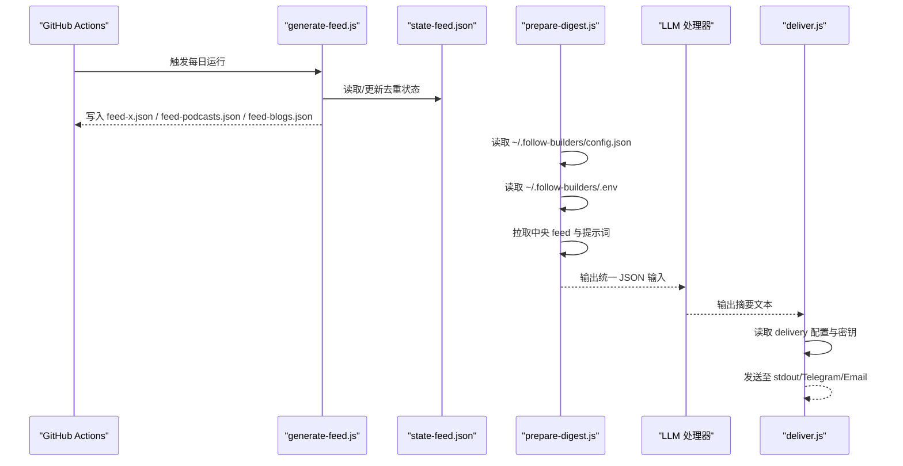
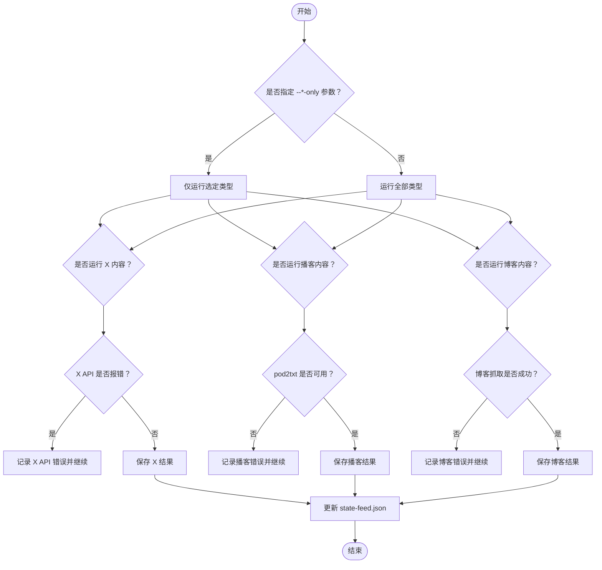
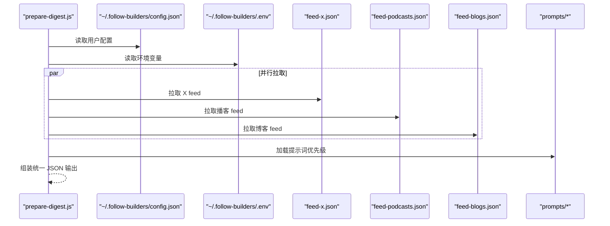
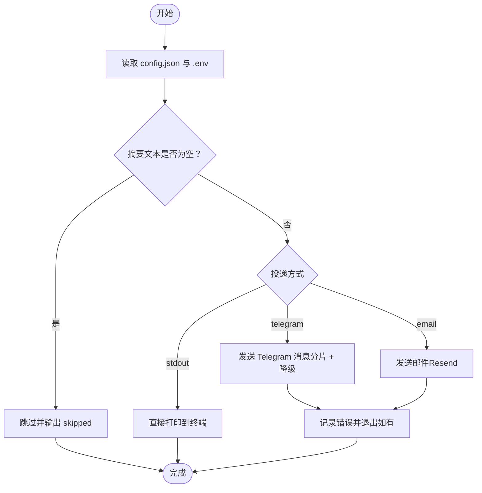
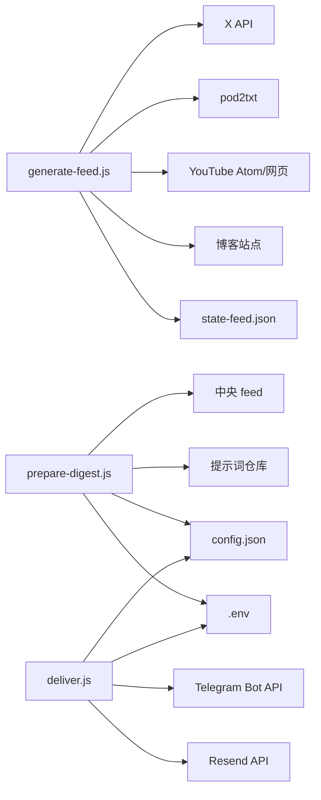

# 故障排除与维护

<cite>
**本文引用的文件**
- [README.md](file://README.md)
- [scripts/package.json](file://scripts/package.json)
- [scripts/generate-feed.js](file://scripts/generate-feed.js)
- [scripts/prepare-digest.js](file://scripts/prepare-digest.js)
- [scripts/deliver.js](file://scripts/deliver.js)
- [config/config-schema.json](file://config/config-schema.json)
- [config/default-sources.json](file://config/default-sources.json)
- [prompts/summarize-blogs.md](file://prompts/summarize-blogs.md)
- [prompts/summarize-podcast.md](file://prompts/summarize-podcast.md)
- [prompts/summarize-tweets.md](file://prompts/summarize-tweets.md)
- [prompts/digest-intro.md](file://prompts/digest-intro.md)
- [prompts/translate.md](file://prompts/translate.md)
- [examples/sample-digest.md](file://examples/sample-digest.md)
</cite>

## 目录
1. [简介](#简介)
2. [项目结构](#项目结构)
3. [核心组件](#核心组件)
4. [架构总览](#架构总览)
5. [详细组件分析](#详细组件分析)
6. [依赖关系分析](#依赖关系分析)
7. [性能考量](#性能考量)
8. [故障排除指南](#故障排除指南)
9. [结论](#结论)
10. [附录](#附录)

## 简介
本指南面向 Follow Builders 的系统管理员与维护人员，聚焦于安装、配置、运行时问题排查、日志分析、错误与异常处理策略、性能监控与健康检查、备份与恢复流程，以及社区支持与问题反馈渠道。文档基于仓库中的脚本、配置与提示词文件进行归纳总结，帮助快速定位与解决常见问题。

## 项目结构
Follow Builders 采用“中央生成 + 本地消费”的模式：每日由 GitHub Actions 在 UTC 早上 6 点运行中央脚本生成 feed 文件；用户侧通过本地脚本拉取中央 feed 并结合提示词生成摘要，再按配置投递到终端、Telegram 或邮箱。

图表来源
- [scripts/generate-feed.js:976-1099](file://scripts/generate-feed.js#L976-L1099)
- [scripts/prepare-digest.js:56-157](file://scripts/prepare-digest.js#L56-L157)
- [scripts/deliver.js:152-215](file://scripts/deliver.js#L152-L215)

章节来源
- [README.md:85-119](file://README.md#L85-L119)
- [scripts/package.json:1-16](file://scripts/package.json#L1-L16)

## 核心组件
- 中央生成器 generate-feed.js：负责抓取 X/Twitter、播客 RSS + 转录、官方博客内容，写入 feed 文件并维护去重状态。
- 摘要准备 prepare-digest.js：从中央 feed 与提示词仓库拉取数据，输出给 LLM 的统一 JSON 输入。
- 投递 deliver.js：根据用户配置将摘要投递到 stdout、Telegram 或邮箱。
- 配置与源列表：config-schema.json 定义用户配置项；default-sources.json 定义默认源。
- 提示词：prompts/* 定义摘要风格与格式化规则。

章节来源
- [scripts/generate-feed.js:976-1099](file://scripts/generate-feed.js#L976-L1099)
- [scripts/prepare-digest.js:56-157](file://scripts/prepare-digest.js#L56-L157)
- [scripts/deliver.js:152-215](file://scripts/deliver.js#L152-L215)
- [config/config-schema.json:1-66](file://config/config-schema.json#L1-L66)
- [config/default-sources.json:1-78](file://config/default-sources.json#L1-L78)

## 架构总览
以下序列图展示一次完整运行的关键调用链：中央生成 -> 用户准备 -> LLM 处理 -> 投递。

图表来源
- [scripts/generate-feed.js:976-1099](file://scripts/generate-feed.js#L976-L1099)
- [scripts/prepare-digest.js:56-157](file://scripts/prepare-digest.js#L56-L157)
- [scripts/deliver.js:152-215](file://scripts/deliver.js#L152-L215)

## 详细组件分析

### 组件一：中央生成器 generate-feed.js
职责与关键点
- 从 RSS、YouTube、X/Twitter、博客站点抓取内容，按时间窗口与去重策略生成 feed。
- 支持按参数仅运行某类内容（如仅播客），便于调试与限速。
- 对外部服务（pod2txt、X API、博客站点）设置超时与错误收集，保证可恢复性。
- 使用 state-feed.json 记录已见过的内容 ID/URL，避免重复推送。

常见问题与定位
- X API 速率限制：当返回 429 时会跳过后续账户，需检查令牌权限与配额。
- pod2txt 转录处理中：若状态长时间为 processing，可能需要等待或更换 API Key。
- 博客抓取：不同站点结构差异较大，解析失败时优先检查站点是否变更结构。

图表来源
- [scripts/generate-feed.js:976-1099](file://scripts/generate-feed.js#L976-L1099)

章节来源
- [scripts/generate-feed.js:976-1099](file://scripts/generate-feed.js#L976-L1099)

### 组件二：摘要准备 prepare-digest.js
职责与关键点
- 读取用户配置（语言、频率、投递方式等）。
- 并行拉取三个中央 feed。
- 优先级加载提示词：用户自定义 > 远程最新 > 本地默认。
- 输出统一 JSON，供 LLM 严格遵循提示词生成摘要。

常见问题与定位
- 无法拉取中央 feed：检查网络连通性与 GitHub 仓库访问权限。
- 提示词加载失败：确认远程提示词仓库可访问，或本地存在默认提示词。

图表来源
- [scripts/prepare-digest.js:56-157](file://scripts/prepare-digest.js#L56-L157)

章节来源
- [scripts/prepare-digest.js:56-157](file://scripts/prepare-digest.js#L56-L157)

### 组件三：投递 deliver.js
职责与关键点
- 支持 stdout、Telegram、Email 三种投递方式。
- Telegram：自动分片发送，超过字符上限时按换行切分；Markdown 解析失败时自动回退。
- Email：使用 Resend API，需提供 API Key 与收件地址。
- 读取配置与 .env，确保密钥与目标存在。

常见问题与定位
- Telegram：缺少 TOKEN 或 chatId 会导致初始化失败；Markdown 解析错误会自动降级。
- Email：缺少 API Key 或邮箱地址会导致初始化失败；Resend 返回错误需检查配额与地址有效性。
- stdout：无额外依赖，常用于本地调试。

图表来源
- [scripts/deliver.js:152-215](file://scripts/deliver.js#L152-L215)

章节来源
- [scripts/deliver.js:152-215](file://scripts/deliver.js#L152-L215)

### 组件四：配置与提示词
- 配置 schema：定义语言、时区、频率、投递方式、Telegram/Email 参数等。
- 默认源：播客、博客、X 账号列表，便于快速启用。
- 提示词：控制摘要长度、语气、格式与翻译策略，影响最终输出质量。

章节来源
- [config/config-schema.json:1-66](file://config/config-schema.json#L1-L66)
- [config/default-sources.json:1-78](file://config/default-sources.json#L1-L78)
- [prompts/summarize-blogs.md:1-19](file://prompts/summarize-blogs.md#L1-L19)
- [prompts/summarize-podcast.md:1-18](file://prompts/summarize-podcast.md#L1-L18)
- [prompts/summarize-tweets.md:1-22](file://prompts/summarize-tweets.md#L1-L22)
- [prompts/digest-intro.md:1-60](file://prompts/digest-intro.md#L1-L60)
- [prompts/translate.md:1-19](file://prompts/translate.md#L1-L19)

## 依赖关系分析
- generate-feed.js 依赖外部服务：X API、pod2txt、YouTube Atom/网页、博客站点；同时维护本地 state-feed.json。
- prepare-digest.js 依赖中央 feed 与提示词仓库；读取用户配置与 .env。
- deliver.js 依赖 Telegram/Resend API；读取用户配置与 .env。
- 配置与提示词文件为静态资源，作为运行期输入。

图表来源
- [scripts/generate-feed.js:976-1099](file://scripts/generate-feed.js#L976-L1099)
- [scripts/prepare-digest.js:56-157](file://scripts/prepare-digest.js#L56-L157)
- [scripts/deliver.js:152-215](file://scripts/deliver.js#L152-L215)

章节来源
- [scripts/package.json:1-16](file://scripts/package.json#L1-L16)

## 性能考量
- 限流与节流
  - X API：每账户请求间有短延迟，避免触发速率限制。
  - 博客抓取：对单文章抓取设置延迟，礼貌访问。
  - Telegram：分片发送时增加小延迟，避免被限流。
- 超时与重试
  - RSS/博客抓取设置合理超时；pod2txt 转录轮询最多数次。
- 去重与窗口
  - 通过 lookback 时间窗与 state-feed.json 减少重复内容与无效请求。
- 并行拉取
  - prepare-digest.js 并行获取三个 feed，缩短端到端等待时间。

章节来源
- [scripts/generate-feed.js:520-633](file://scripts/generate-feed.js#L520-L633)
- [scripts/generate-feed.js:859-974](file://scripts/generate-feed.js#L859-L974)
- [scripts/prepare-digest.js:76-80](file://scripts/prepare-digest.js#L76-L80)
- [scripts/deliver.js:120-122](file://scripts/deliver.js#L120-L122)

## 故障排除指南

### 安装与环境准备
- 安装依赖
  - 在技能目录执行安装命令，确保 Node.js 环境可用。
- 权限与路径
  - 确保用户目录 ~/.follow-builders 存在且可读写；必要时手动创建并放置 config.json 与 .env。

章节来源
- [README.md:85-101](file://README.md#L85-L101)
- [scripts/package.json:6-10](file://scripts/package.json#L6-L10)

### 配置错误
- 必填字段缺失
  - Telegram：需在 .env 中设置 TELEGRAM_BOT_TOKEN，在 config.json 中设置 chatId。
  - Email：需在 .env 中设置 RESEND_API_KEY，在 config.json 中设置 email。
- 配置校验
  - config-schema.json 定义了合法值域与默认值，建议使用该 schema 校验 config.json。
- 提示词优先级
  - 若用户自定义了提示词，prepare-digest.js 将优先使用用户版本，避免被远程更新覆盖。

章节来源
- [scripts/deliver.js:172-199](file://scripts/deliver.js#L172-L199)
- [scripts/prepare-digest.js:92-121](file://scripts/prepare-digest.js#L92-L121)
- [config/config-schema.json:1-66](file://config/config-schema.json#L1-L66)

### 网络连接问题
- 中央 feed 拉取失败
  - 检查 prepare-digest.js 是否能访问 GitHub raw 地址；若内网受限，考虑代理或镜像。
- 博客站点抓取失败
  - 不同站点结构变化可能导致解析失败；可先单独抓取索引页验证结构。
- YouTube/Atom RSS 不稳定
  - 当 Atom 失败时会回退到网页抓取；若仍失败，检查频道 URL 与网络连通性。

章节来源
- [scripts/prepare-digest.js:76-84](file://scripts/prepare-digest.js#L76-L84)
- [scripts/generate-feed.js:226-264](file://scripts/generate-feed.js#L226-L264)
- [scripts/generate-feed.js:859-974](file://scripts/generate-feed.js#L859-L974)

### API 限制与错误码
- X API 429（速率限制）
  - 表现：后续账户不再处理；建议降低并发或提升配额。
- pod2txt 处理中/超时
  - 表现：多次轮询后仍为 processing；建议更换 Key 或稍后再试。
- Telegram/Resend 错误
  - 表现：API 返回错误描述；检查 TOKEN/chatId/API Key 与目标地址。

章节来源
- [scripts/generate-feed.js:577-585](file://scripts/generate-feed.js#L577-L585)
- [scripts/generate-feed.js:356-371](file://scripts/generate-feed.js#L356-L371)
- [scripts/deliver.js:99-118](file://scripts/deliver.js#L99-L118)
- [scripts/deliver.js:146-149](file://scripts/deliver.js#L146-L149)

### 日志分析与调试技巧
- generate-feed.js
  - 使用 --tweets-only/--podcasts-only/--blogs-only 仅运行某类内容，缩小问题范围。
  - 关注“RSS fetch failed”“Transcript error”“Failed to fetch article”等错误行。
- prepare-digest.js
  - 关注“Could not fetch feed”“Could not load prompt”等错误行。
- deliver.js
  - 关注“Empty digest text”“TELEGRAM_BOT_TOKEN not found”“RESEND_API_KEY not found”等提示。

章节来源
- [scripts/generate-feed.js:978-988](file://scripts/generate-feed.js#L978-L988)
- [scripts/generate-feed.js:402-408](file://scripts/generate-feed.js#L402-L408)
- [scripts/generate-feed.js:468-475](file://scripts/generate-feed.js#L468-L475)
- [scripts/generate-feed.js:876-880](file://scripts/generate-feed.js#L876-L880)
- [scripts/prepare-digest.js:82-84](file://scripts/prepare-digest.js#L82-L84)
- [scripts/prepare-digest.js:118-120](file://scripts/prepare-digest.js#L118-L120)
- [scripts/deliver.js:166-169](file://scripts/deliver.js#L166-L169)
- [scripts/deliver.js:176-178](file://scripts/deliver.js#L176-L178)
- [scripts/deliver.js:190-192](file://scripts/deliver.js#L190-L192)

### 性能监控与健康检查
- 健康检查清单
  - 每日运行时间：确认 GitHub Actions 已按时触发。
  - feed 文件生成：检查 feed-x.json、feed-podcasts.json、feed-blogs.json 是否更新。
  - 去重状态：state-feed.json 是否增长但未无限膨胀（保留最近 7 天）。
  - 投递测试：至少一次 stdout/Telegram/Email 测试，验证配置正确。
- 性能指标建议
  - RSS/博客抓取耗时、X API 请求次数与成功率、pod2txt 转录等待时间、Telegram/Resend 成功率与延迟。

章节来源
- [scripts/generate-feed.js:57-70](file://scripts/generate-feed.js#L57-L70)
- [scripts/generate-feed.js:1018-1035](file://scripts/generate-feed.js#L1018-L1035)
- [scripts/generate-feed.js:1048-1063](file://scripts/generate-feed.js#L1048-L1063)
- [scripts/generate-feed.js:1071-1086](file://scripts/generate-feed.js#L1071-L1086)

### 备份与恢复
- 重要文件
  - config.json：用户配置（语言、频率、投递方式、Telegram/Email 参数）。
  - .env：密钥与凭据（TELEGRAM_BOT_TOKEN、RESEND_API_KEY 等）。
  - state-feed.json：去重状态，避免重复内容。
- 备份建议
  - 定期导出上述文件到安全位置；建议纳入版本控制（除 .env 外）。
- 恢复步骤
  - 恢复 config.json 与 .env 至 ~/.follow-builders/。
  - 如需重放历史，可保留 state-feed.json 以维持去重一致性。

章节来源
- [scripts/deliver.js:31-33](file://scripts/deliver.js#L31-L33)
- [scripts/generate-feed.js:43-70](file://scripts/generate-feed.js#L43-L70)

### 维护检查清单与预防性维护
- 每日
  - 检查 GitHub Actions 执行日志，确认 feed 生成成功。
  - 验证 feed 文件更新时间与内容数量。
- 每周
  - 回顾 prepare-digest.js 的错误日志，关注提示词加载与 feed 拉取失败。
  - 检查 Telegram/Resend 投递成功率与错误描述。
- 每月
  - 更新提示词（prepare-digest.js 会优先使用用户自定义，其次远程最新，最后本地默认）。
  - 检查 X API 与 pod2txt 的可用性与配额。
- 年度
  - 清理旧的 state-feed.json 条目（脚本会自动清理 7 天前条目）。
  - 备份 config.json 与 .env。

章节来源
- [scripts/prepare-digest.js:108-121](file://scripts/prepare-digest.js#L108-L121)
- [scripts/generate-feed.js:57-70](file://scripts/generate-feed.js#L57-L70)

### 社区支持与问题报告
- 仓库与示例
  - 参考示例输出了解预期格式与风格。
- 问题反馈
  - 请附带：
    - 重现步骤
    - 相关日志片段（来自 generate-feed.js/prepare-digest.js/deliver.js）
    - 配置与 .env 关键字段（脱敏处理）
    - 使用的平台与 Node 版本

章节来源
- [examples/sample-digest.md:1-61](file://examples/sample-digest.md#L1-L61)
- [README.md:121-127](file://README.md#L121-L127)

## 结论
通过明确各组件职责、掌握日志分析方法、建立健康检查与备份机制，可以有效降低 Follow Builders 的运行风险并提升稳定性。遇到问题时，优先使用 --only 参数缩小范围，结合错误码与提示词优先级定位根因，并按维护清单定期巡检与优化。

## 附录
- 示例输出参考：examples/sample-digest.md
- 提示词文件：prompts/*.md
- 默认源配置：config/default-sources.json
- 配置 schema：config/config-schema.json