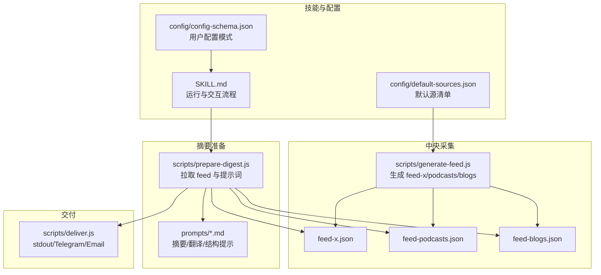
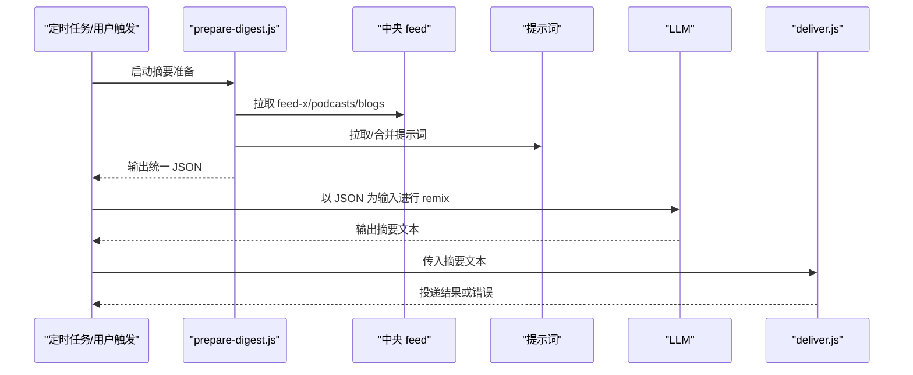
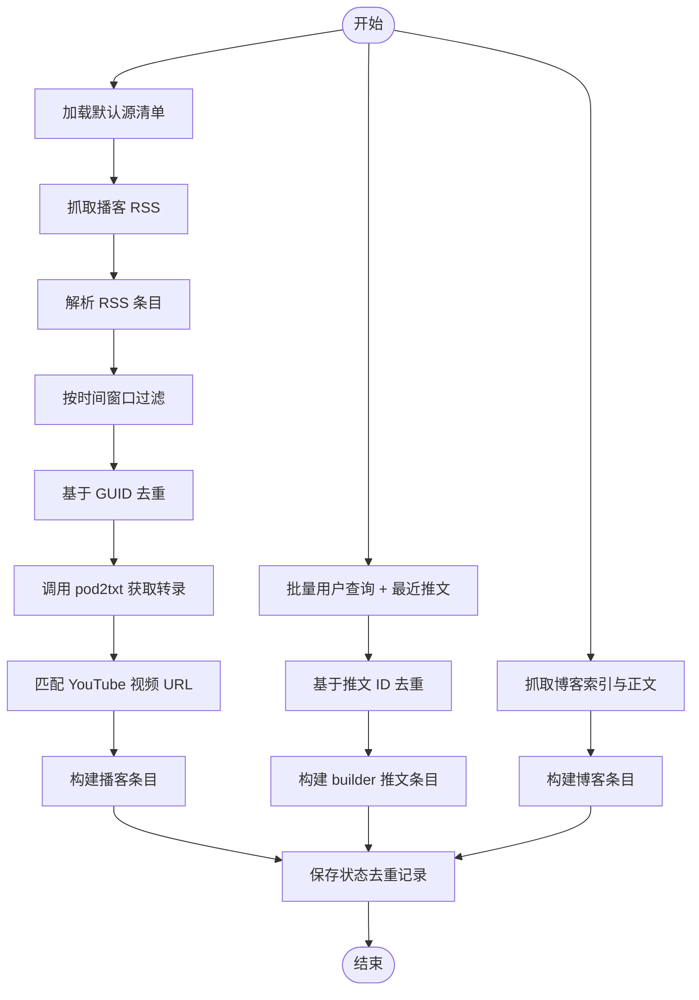
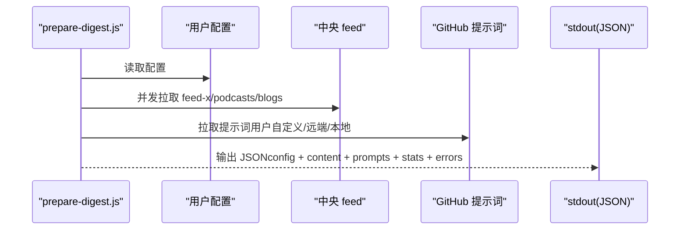
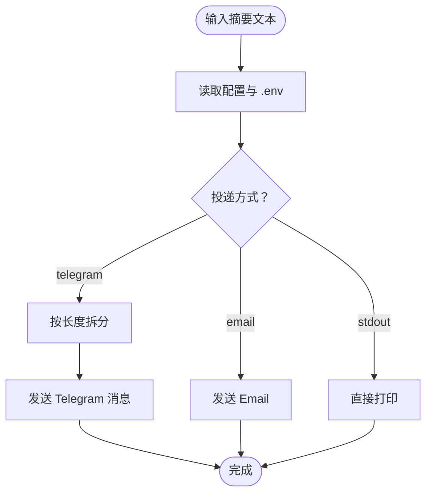
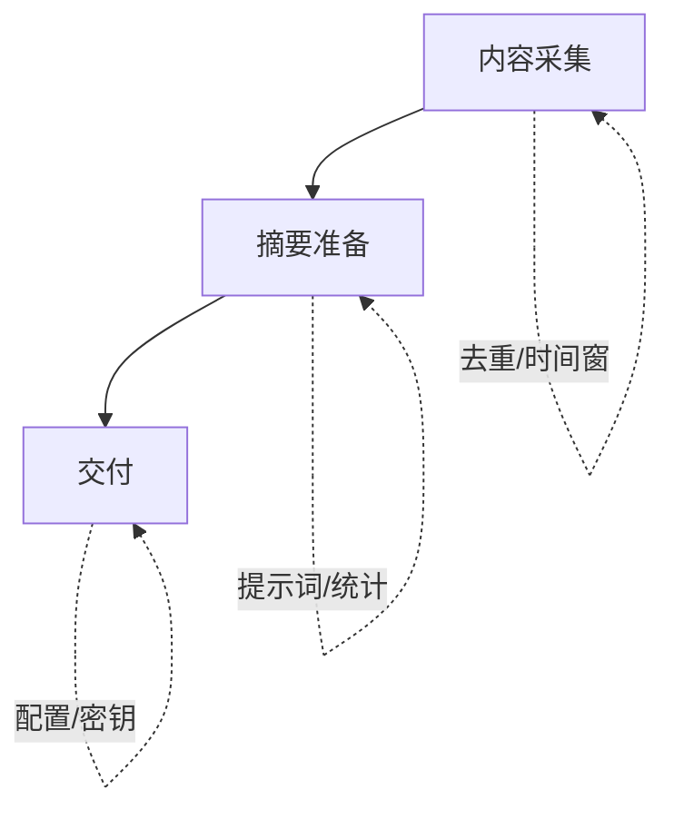
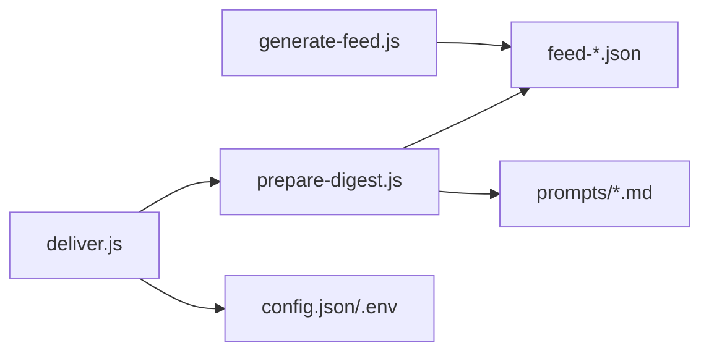

# 核心功能

<cite>
**本文引用的文件**   
- [README.md](file://README.md)
- [SKILL.md](file://SKILL.md)
- [config/default-sources.json](file://config/default-sources.json)
- [config/config-schema.json](file://config/config-schema.json)
- [scripts/generate-feed.js](file://scripts/generate-feed.js)
- [scripts/prepare-digest.js](file://scripts/prepare-digest.js)
- [scripts/deliver.js](file://scripts/deliver.js)
- [prompts/summarize-blogs.md](file://prompts/summarize-blogs.md)
- [prompts/summarize-podcast.md](file://prompts/summarize-podcast.md)
- [prompts/summarize-tweets.md](file://prompts/summarize-tweets.md)
- [prompts/digest-intro.md](file://prompts/digest-intro.md)
- [prompts/translate.md](file://prompts/translate.md)
- [examples/sample-digest.md](file://examples/sample-digest.md)
- [feed-x.json](file://feed-x.json)
- [feed-podcasts.json](file://feed-podcasts.json)
- [feed-blogs.json](file://feed-blogs.json)
</cite>

## 目录
1. [简介](#简介)
2. [项目结构](#项目结构)
3. [核心组件](#核心组件)
4. [架构总览](#架构总览)
5. [详细组件分析](#详细组件分析)
6. [依赖分析](#依赖分析)
7. [性能考虑](#性能考虑)
8. [故障排查指南](#故障排查指南)
9. [结论](#结论)
10. [附录](#附录)

## 简介
本文件面向 Follow Builders 的核心功能模块，系统化阐述三大能力：内容采集系统、摘要生成引擎与交付系统。文档从概念到实现逐层展开，既适合初学者理解“如何工作”，也为开发者提供深入的技术细节、数据流与依赖关系说明，并给出可操作的配置与排障建议。

## 项目结构
Follow Builders 采用“技能（Skill）+ 脚本”的组织方式：
- 技能定义与运行流程：通过 SKILL.md 描述用户交互、设置项、调度与交付路径
- 中央内容采集：scripts/generate-feed.js 在 GitHub Actions 上每日生成 feed-x.json、feed-podcasts.json、feed-blogs.json
- 摘要准备：scripts/prepare-digest.js 拉取中央 feed 与提示词，组装为 LLM 可直接 remix 的 JSON
- 交付：scripts/deliver.js 根据配置将摘要投递至 stdout、Telegram 或 Email
- 提示词：prompts/*.md 定义摘要风格、翻译规则与整体结构
- 配置：config/default-sources.json 列出默认来源；config/config-schema.json 定义用户配置字段与默认值
- 示例输出：examples/sample-digest.md 展示最终摘要格式

图表来源
- [SKILL.md: 307-410:307-410](file://SKILL.md#L307-L410)
- [scripts/generate-feed.js: 1-1100:1-1100](file://scripts/generate-feed.js#L1-L1100)
- [scripts/prepare-digest.js: 1-166:1-166](file://scripts/prepare-digest.js#L1-L166)
- [scripts/deliver.js: 1-218:1-218](file://scripts/deliver.js#L1-L218)
- [config/default-sources.json: 1-78:1-78](file://config/default-sources.json#L1-L78)
- [config/config-schema.json: 1-66:1-66](file://config/config-schema.json#L1-L66)

章节来源
- [README.md: 111-119:111-119](file://README.md#L111-L119)
- [SKILL.md: 307-410:307-410](file://SKILL.md#L307-L410)

## 核心组件
- 内容采集系统（generate-feed.js）
  - 功能：从 X/Twitter、播客 RSS/YouTube、官方博客三类来源抓取最新内容，去重、转录、匹配视频链接，生成 feed 文件
  - 关键点：时间窗口过滤、状态持久化、错误聚合、多源解析策略
- 摘要生成引擎（prepare-digest.js + prompts/*.md）
  - 功能：拉取中央 feed 与提示词，组装统一 JSON 输出给 LLM；LLM 仅负责 remix，不访问外部资源
  - 关键点：提示词优先级（用户自定义 > 远端 > 本地）、统计信息、错误兜底
- 交付系统（deliver.js）
  - 功能：根据配置将摘要投递到 stdout、Telegram 或 Email；支持分段发送与回退
  - 关键点：环境变量读取、方法选择、错误日志 JSON 化

章节来源
- [scripts/generate-feed.js: 1-1100:1-1100](file://scripts/generate-feed.js#L1-L1100)
- [scripts/prepare-digest.js: 1-166:1-166](file://scripts/prepare-digest.js#L1-L166)
- [scripts/deliver.js: 1-218:1-218](file://scripts/deliver.js#L1-L218)
- [prompts/digest-intro.md: 1-60:1-60](file://prompts/digest-intro.md#L1-L60)
- [prompts/translate.md: 1-19:1-19](file://prompts/translate.md#L1-L19)

## 架构总览
Follow Builders 的运行链路分为“中央采集 -> 摘要准备 -> 交付”三层，技能侧仅负责编排与配置管理，内容与提示词由中央 feed 与 GitHub 提供，确保一致性与可更新性。

图表来源
- [SKILL.md: 307-410:307-410](file://SKILL.md#L307-L410)
- [scripts/prepare-digest.js: 56-157:56-157](file://scripts/prepare-digest.js#L56-L157)
- [scripts/deliver.js: 154-215:154-215](file://scripts/deliver.js#L154-L215)

## 详细组件分析

### 组件A：内容采集系统（generate-feed.js）
- 设计目标
  - 从多源聚合高质量内容，保证去重与稳定性
  - 通过状态文件记录已见内容，避免重复推送
- 数据流
  - 加载默认源清单（RSS/YouTube/博客）
  - 并行抓取与解析：播客 RSS -> pod2txt 转录 -> 匹配 YouTube 视频
  - X/Twitter 批量用户查询 + 最近推文抓取（排除转发/回复）
  - 博客抓取：解析索引页提取文章元信息，必要时抓取正文
  - 去重与时间窗口过滤后写入 feed
- 处理逻辑要点
  - 时间窗口：推文 24 小时、播客 14 天、博客 72 小时
  - 最大条目限制：每源最多若干条候选，最终选最优一条转录
  - 标题归一化与模糊匹配用于 RSS 与 YouTube 对齐
  - pod2txt 异步转录轮询，超时保护
- 输出格式
  - feed-x.json：builder 列表 + 推文数组（含 URL、互动数等）
  - feed-podcasts.json：播客列表（含标题、GUID、URL、发布时间、转录）
  - feed-blogs.json：博客列表（含标题、URL、作者、摘要、正文）

图表来源
- [scripts/generate-feed.js: 72-520:72-520](file://scripts/generate-feed.js#L72-L520)
- [scripts/generate-feed.js: 521-633:521-633](file://scripts/generate-feed.js#L521-L633)
- [scripts/generate-feed.js: 635-800:635-800](file://scripts/generate-feed.js#L635-L800)

章节来源
- [scripts/generate-feed.js: 16-71:16-71](file://scripts/generate-feed.js#L16-L71)
- [scripts/generate-feed.js: 72-118:72-118](file://scripts/generate-feed.js#L72-L118)
- [scripts/generate-feed.js: 373-519:373-519](file://scripts/generate-feed.js#L373-L519)
- [scripts/generate-feed.js: 521-633:521-633](file://scripts/generate-feed.js#L521-L633)
- [scripts/generate-feed.js: 635-800:635-800](file://scripts/generate-feed.js#L635-L800)

### 组件B：摘要生成引擎（prepare-digest.js + prompts/*.md）
- 设计目标
  - 将中央 feed 与提示词打包为单一 JSON，交由 LLM 进行 remix
  - 保持 LLM 不访问外部网络，仅使用 JSON 内容
- 数据流
  - 读取用户配置（语言、频率、投递方式）
  - 并发拉取三个 feed（失败记录到 errors）
  - 按优先级加载提示词：用户自定义 > 远端 GitHub > 本地默认
  - 统计信息（播客条目数、builder 数、推文总数、feed 生成时间）
- 处理逻辑要点
  - 提示词合并：summarize-podcast、summarize-tweets、summarize-blogs、digest-intro、translate
  - 输出 JSON 结构包含 config、podcasts、x、blogs、stats、prompts、errors
- 输出格式
  - JSON 字符串，stdout 输出，供 LLM 读取与 remix

图表来源
- [scripts/prepare-digest.js: 56-157:56-157](file://scripts/prepare-digest.js#L56-L157)
- [prompts/summarize-podcast.md: 1-18:1-18](file://prompts/summarize-podcast.md#L1-L18)
- [prompts/summarize-tweets.md: 1-22:1-22](file://prompts/summarize-tweets.md#L1-L22)
- [prompts/summarize-blogs.md: 1-19:1-19](file://prompts/summarize-blogs.md#L1-L19)
- [prompts/digest-intro.md: 1-60:1-60](file://prompts/digest-intro.md#L1-L60)
- [prompts/translate.md: 1-19:1-19](file://prompts/translate.md#L1-L19)

章节来源
- [scripts/prepare-digest.js: 56-157:56-157](file://scripts/prepare-digest.js#L56-L157)
- [config/config-schema.json: 1-66:1-66](file://config/config-schema.json#L1-L66)

### 组件C：交付系统（deliver.js）
- 设计目标
  - 根据用户配置与环境变量，将摘要投递到 stdout、Telegram 或 Email
- 输入来源
  - 从 stdin、--message 或 --file 读取摘要文本
  - 读取 ~/.follow-builders/config.json 与 .env
- 处理逻辑要点
  - Telegram：4096 字符上限拆分，Markdown 解析失败自动回退
  - Email（Resend）：带主题与纯文本正文
  - stdout：直接打印
  - 错误统一 JSON 化输出，便于上层捕获
- 输出格式
  - 成功：人类可读文本或 JSON（status: ok）
  - 失败：JSON（status: error, message）

图表来源
- [scripts/deliver.js: 35-215:35-215](file://scripts/deliver.js#L35-L215)

章节来源
- [scripts/deliver.js: 1-218:1-218](file://scripts/deliver.js#L1-L218)

### 概念性总览
- 内容采集：集中式抓取，去重与时间窗口控制，确保新鲜度与唯一性
- 摘要生成：提示词驱动，LLM 仅做 remix，不联网，保证一致性与隐私
- 交付：按用户偏好投递，支持 Telegram/Email/stdout，具备错误回退

（此图为概念图，无需图表来源）

## 依赖分析
- 组件耦合
  - generate-feed.js 与 config/default-sources.json 强耦合（RSS/YouTube/博客配置）
  - prepare-digest.js 依赖 generate-feed.js 产出的 feed 与 prompts/*.md
  - deliver.js 依赖 prepare-digest.js 输出的 JSON 与用户配置
- 外部依赖
  - X/Twitter API v2（Bearer Token）
  - pod2txt 转录服务（API Key）
  - Telegram Bot API / Resend API（凭据存于 .env）
- 潜在循环依赖
  - 无直接循环；prepare-digest.js 仅读取中央 feed，不反向依赖技能

图表来源
- [scripts/generate-feed.js: 72-78:72-78](file://scripts/generate-feed.js#L72-L78)
- [scripts/prepare-digest.js: 29-40:29-40](file://scripts/prepare-digest.js#L29-L40)
- [scripts/deliver.js: 23-34:23-34](file://scripts/deliver.js#L23-L34)

章节来源
- [scripts/generate-feed.js: 12-14:12-14](file://scripts/generate-feed.js#L12-L14)
- [scripts/prepare-digest.js: 29-40:29-40](file://scripts/prepare-digest.js#L29-L40)
- [scripts/deliver.js: 17-21:17-21](file://scripts/deliver.js#L17-L21)

## 性能考虑
- 并发抓取
  - prepare-digest.js 对三个 feed 使用并发请求，缩短等待时间
- I/O 与网络
  - generate-feed.js 对 RSS/YouTube/博客分别设置合理超时与解析策略，避免阻塞
- 文本长度控制
  - deliver.js 对 Telegram 分段发送，减少失败重试成本
- 去重与缓存
  - state-feed.json 记录已见内容，避免重复处理与投递

（本节为通用指导，无需章节来源）

## 故障排查指南
- 无法获取摘要
  - 检查 prepare-digest.js 是否成功拉取 feed；若返回错误数组，优先修复网络与权限
  - 参考：[scripts/prepare-digest.js: 82-84:82-84](file://scripts/prepare-digest.js#L82-L84)
- Telegram 投递失败
  - 检查 TELEGRAM_BOT_TOKEN 与 chatId 是否正确；查看 deliver.js 的错误 JSON 输出
  - 参考：[scripts/deliver.js: 174-178:174-178](file://scripts/deliver.js#L174-L178)
- Email 投递失败
  - 检查 RESEND_API_KEY 与收件邮箱；查看错误 JSON 输出
  - 参考：[scripts/deliver.js: 188-192:188-192](file://scripts/deliver.js#L188-L192)
- 提示词未生效
  - 确认 ~/.follow-builders/prompts 下是否覆盖了对应文件；prepare-digest.js 会优先使用用户自定义提示词
  - 参考：[scripts/prepare-digest.js: 97-121:97-121](file://scripts/prepare-digest.js#L97-L121)
- 摘要为空
  - 检查 feed 的 stats 字段；若播客与 builder 均为 0，则按设计跳过投递
  - 参考：[feed-x.json: 467-471:467-471](file://feed-x.json#L467-L471)、[feed-podcasts.json: 15-18:15-18](file://feed-podcasts.json#L15-L18)

章节来源
- [scripts/prepare-digest.js: 82-84:82-84](file://scripts/prepare-digest.js#L82-L84)
- [scripts/deliver.js: 174-192:174-192](file://scripts/deliver.js#L174-L192)
- [scripts/prepare-digest.js: 97-121:97-121](file://scripts/prepare-digest.js#L97-L121)
- [feed-x.json: 467-471:467-471](file://feed-x.json#L467-L471)
- [feed-podcasts.json: 15-18:15-18](file://feed-podcasts.json#L15-L18)

## 结论
Follow Builders 的三大核心能力通过“集中采集 + 提示词驱动 + 多通道交付”的架构实现高可靠与可定制。内容采集系统确保新鲜与唯一，摘要生成引擎将 remix 交给 LLM，交付系统则灵活适配不同渠道。配合清晰的配置与提示词体系，既能满足初学者快速上手，也能为高级用户提供深度定制空间。

## 附录
- 默认源清单
  - 播客：6 个（RSS 源与频道/播放列表）
  - 博客：2 个（官方工程博客与产品博客）
  - X/Twitter：25 位 AI Builder
  - 参考：[config/default-sources.json: 1-78:1-78](file://config/default-sources.json#L1-L78)
- 用户配置模式
  - 字段：platform、language、timezone、frequency、deliveryTime、weeklyDay、delivery、onboardingComplete
  - 参考：[config/config-schema.json: 1-66:1-66](file://config/config-schema.json#L1-L66)
- 示例摘要输出
  - 参考：[examples/sample-digest.md: 1-61:1-61](file://examples/sample-digest.md#L1-L61)
- 中央 feed 示例
  - 参考：[feed-x.json: 1-471:1-471](file://feed-x.json#L1-L471)、[feed-podcasts.json: 1-18:1-18](file://feed-podcasts.json#L1-L18)、[feed-blogs.json: 1-19:1-19](file://feed-blogs.json#L1-L19)