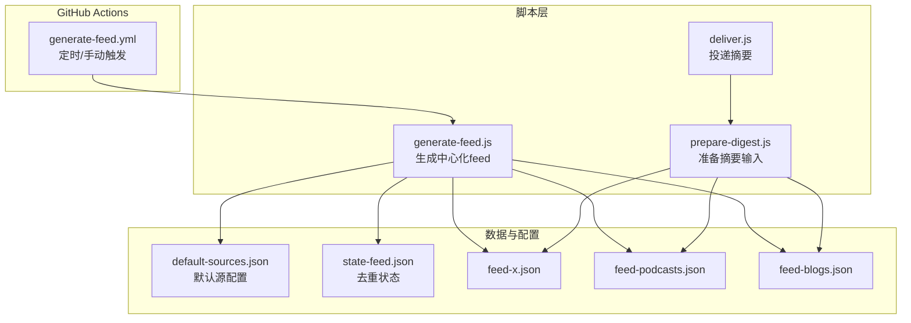
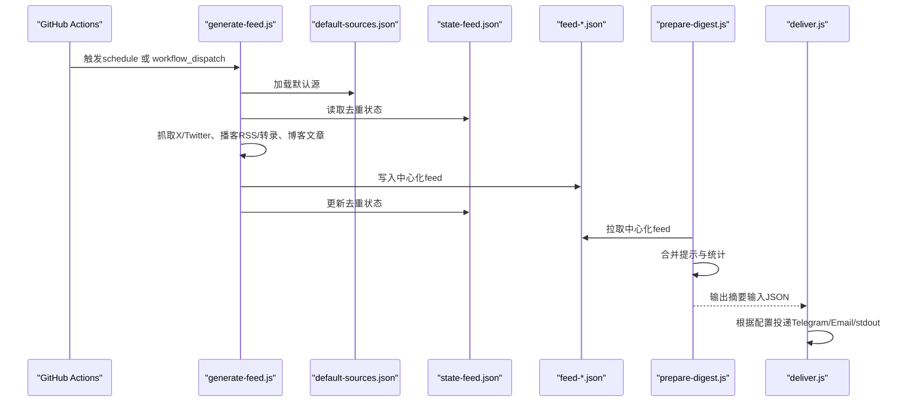
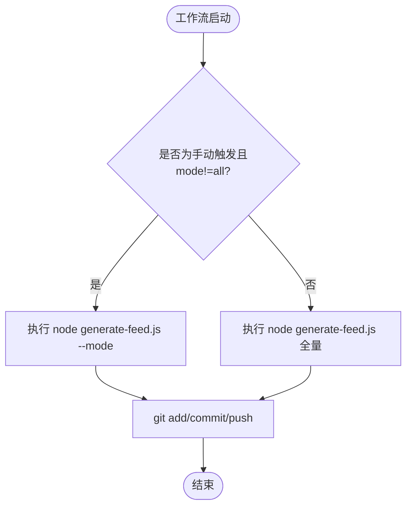
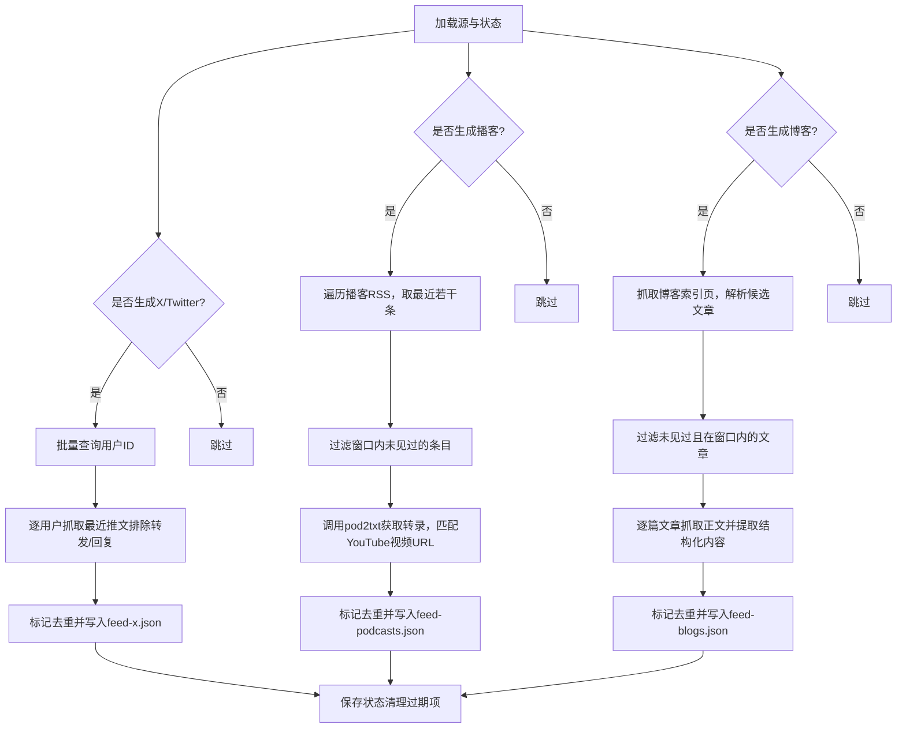
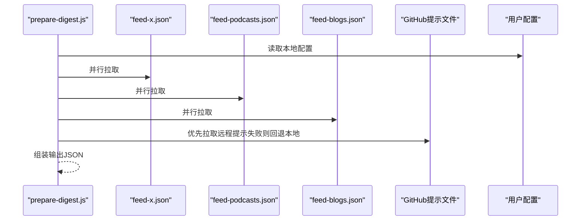
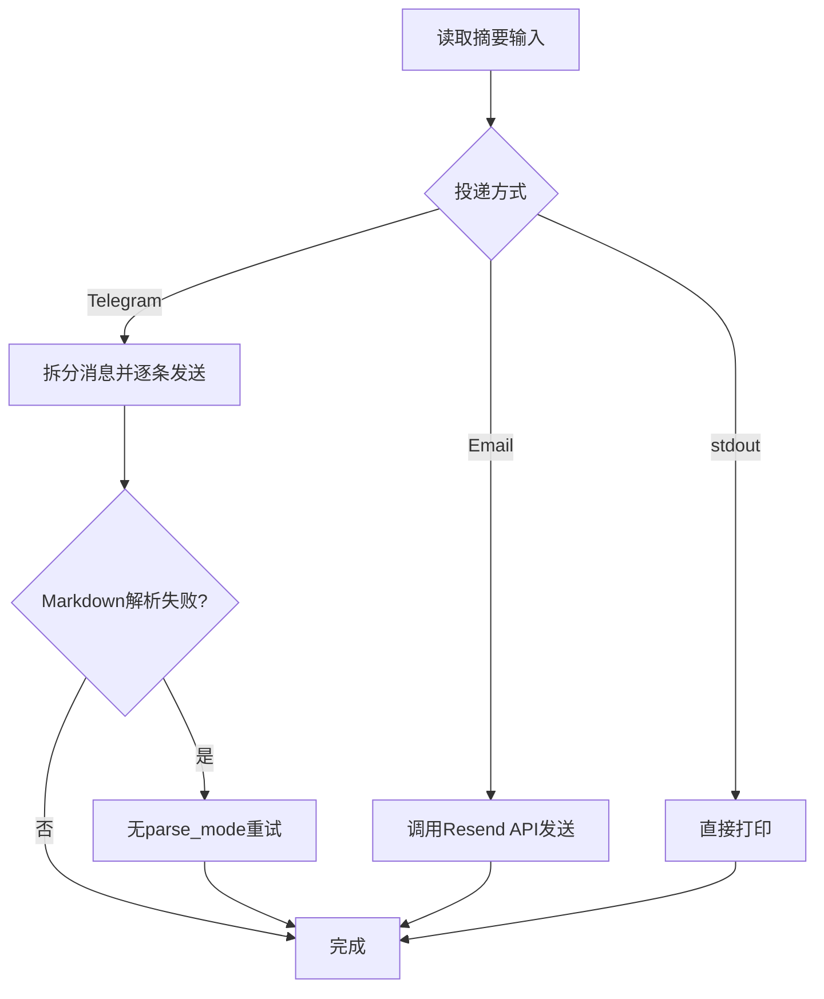
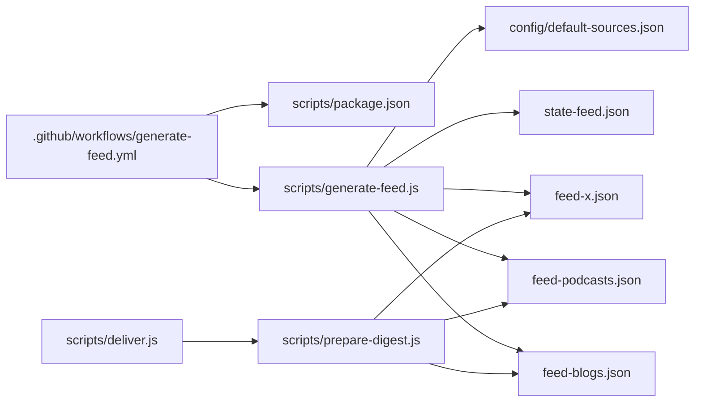

# 自动化调度

<cite>
**本文引用的文件**
- [.github/workflows/generate-feed.yml](file://.github/workflows/generate-feed.yml)
- [scripts/generate-feed.js](file://scripts/generate-feed.js)
- [scripts/deliver.js](file://scripts/deliver.js)
- [scripts/prepare-digest.js](file://scripts/prepare-digest.js)
- [scripts/package.json](file://scripts/package.json)
- [config/default-sources.json](file://config/default-sources.json)
- [feed-x.json](file://feed-x.json)
- [feed-podcasts.json](file://feed-podcasts.json)
- [feed-blogs.json](file://feed-blogs.json)
- [state-feed.json](file://state-feed.json)
- [examples/sample-digest.md](file://examples/sample-digest.md)
- [README.md](file://README.md)
</cite>

## 目录
1. [简介](#简介)
2. [项目结构](#项目结构)
3. [核心组件](#核心组件)
4. [架构总览](#架构总览)
5. [详细组件分析](#详细组件分析)
6. [依赖关系分析](#依赖关系分析)
7. [性能与资源优化](#性能与资源优化)
8. [日志与监控](#日志与监控)
9. [手动触发与调试](#手动触发与调试)
10. [故障排除指南](#故障排除指南)
11. [结论](#结论)

## 简介
本文件面向Follow Builders的自动化调度系统，聚焦于GitHub Actions工作流的配置与执行机制，涵盖：
- 定时任务的设置与触发条件
- 工作流各步骤、错误处理与重试策略
- 日志分析与监控方法
- 手动触发与调试自动化任务
- 性能优化建议与资源使用监控
- 系统管理员维护与故障排除指南

该系统通过每日定时任务抓取X/Twitter、播客（RSS + 转录）、博客文章，并生成中心化的feed文件，供用户侧按需消费与投递。

## 项目结构
仓库采用“工作流 + 脚本 + 配置”的分层组织方式：
- .github/workflows：定义CI/CD工作流（本系统用于自动化调度）
- scripts：Node.js脚本集合（生成feed、准备摘要、投递）
- config：默认源配置（播客、博客、X账号）
- feed-*.json：中心化输出的聚合内容
- state-feed.json：去重状态持久化
- examples：示例摘要输出

图表来源
- [.github/workflows/generate-feed.yml:1-54](file://.github/workflows/generate-feed.yml#L1-L54)
- [scripts/generate-feed.js:1-1100](file://scripts/generate-feed.js#L1-L1100)
- [scripts/prepare-digest.js:1-166](file://scripts/prepare-digest.js#L1-L166)
- [scripts/deliver.js:1-218](file://scripts/deliver.js#L1-L218)
- [config/default-sources.json:1-78](file://config/default-sources.json#L1-L78)
- [feed-x.json:1-200](file://feed-x.json#L1-L200)
- [feed-podcasts.json](file://feed-podcasts.json)
- [feed-blogs.json](file://feed-blogs.json)
- [state-feed.json:1-194](file://state-feed.json#L1-L194)

章节来源
- [.github/workflows/generate-feed.yml:1-54](file://.github/workflows/generate-feed.yml#L1-L54)
- [README.md:1-132](file://README.md#L1-L132)

## 核心组件
- GitHub Actions工作流：定义每日定时触发与手动触发入口，安装Node环境、安装依赖、运行生成脚本、提交并推送变更。
- 生成脚本（generate-feed.js）：负责拉取X/Twitter、播客RSS与转录、博客文章，进行去重与写入中心化feed文件；支持按参数选择仅生成某类内容。
- 准备脚本（prepare-digest.js）：从中心化feed与远程提示文件构建摘要输入JSON，供LLM生成摘要。
- 投递脚本（deliver.js）：根据本地配置与环境变量，将摘要投递到Telegram或邮件，或输出到标准输出。
- 默认源配置（default-sources.json）：包含播客、博客、X账号列表。
- 中心化feed与去重状态：feed-*.json为输出，state-feed.json记录已见过的ID/URL，避免重复。

章节来源
- [scripts/generate-feed.js:1-1100](file://scripts/generate-feed.js#L1-L1100)
- [scripts/prepare-digest.js:1-166](file://scripts/prepare-digest.js#L1-L166)
- [scripts/deliver.js:1-218](file://scripts/deliver.js#L1-L218)
- [config/default-sources.json:1-78](file://config/default-sources.json#L1-L78)
- [feed-x.json:1-200](file://feed-x.json#L1-L200)
- [feed-podcasts.json](file://feed-podcasts.json)
- [feed-blogs.json](file://feed-blogs.json)
- [state-feed.json:1-194](file://state-feed.json#L1-L194)

## 架构总览
下图展示从工作流到脚本、再到外部服务与数据存储的端到端流程。

图表来源
- [.github/workflows/generate-feed.yml:1-54](file://.github/workflows/generate-feed.yml#L1-L54)
- [scripts/generate-feed.js:978-1099](file://scripts/generate-feed.js#L978-L1099)
- [scripts/prepare-digest.js:56-157](file://scripts/prepare-digest.js#L56-L157)
- [scripts/deliver.js:154-215](file://scripts/deliver.js#L154-L215)
- [config/default-sources.json:1-78](file://config/default-sources.json#L1-L78)
- [state-feed.json:1-194](file://state-feed.json#L1-L194)

## 详细组件分析

### GitHub Actions工作流（generate-feed.yml）
- 触发条件
  - schedule：UTC时间每日06:17执行一次
  - workflow_dispatch：允许在GitHub界面手动触发，支持mode参数选择生成范围
- 运行环境
  - ubuntu-latest
  - Node 20
- 步骤
  - checkout仓库
  - setup-node
  - 安装脚本依赖（npm install）
  - 条件执行：若为手动触发且mode非all，则按mode调用生成脚本；否则全量生成
  - 提交并推送变更（仅对三个中心化feed与状态文件）

图表来源
- [.github/workflows/generate-feed.yml:1-54](file://.github/workflows/generate-feed.yml#L1-L54)

章节来源
- [.github/workflows/generate-feed.yml:1-54](file://.github/workflows/generate-feed.yml#L1-L54)

### 生成脚本（generate-feed.js）
- 功能概览
  - 读取默认源配置
  - 读取去重状态（state-feed.json），写入时自动清理过期条目
  - 分别抓取X/Twitter、播客RSS与转录、博客文章
  - 将结果写入feed-x.json、feed-podcasts.json、feed-blogs.json
  - 支持按参数仅生成某类内容（--tweets-only、--podcasts-only、--blogs-only）
- 去重与窗口控制
  - 状态键：seenTweets、seenVideos、seenArticles
  - 时间窗口：推文24小时、播客14天、博客72小时
  - 写入前清理超过7天的历史条目
- 错误处理
  - 对每个源的抓取失败会累积错误信息，最终在对应feed中附带errors字段
  - X API速率限制时提前终止后续账户抓取
- 外部依赖
  - X官方API v2（需要Bearer Token）
  - pod2txt转录服务（需要API Key）
  - RSS解析、YouTube视频匹配、博客文章内容提取

图表来源
- [scripts/generate-feed.js:377-519](file://scripts/generate-feed.js#L377-L519)
- [scripts/generate-feed.js:523-633](file://scripts/generate-feed.js#L523-L633)
- [scripts/generate-feed.js:859-974](file://scripts/generate-feed.js#L859-L974)
- [scripts/generate-feed.js:978-1099](file://scripts/generate-feed.js#L978-L1099)

章节来源
- [scripts/generate-feed.js:1-1100](file://scripts/generate-feed.js#L1-L1100)
- [config/default-sources.json:1-78](file://config/default-sources.json#L1-L78)
- [state-feed.json:1-194](file://state-feed.json#L1-L194)

### 准备脚本（prepare-digest.js）
- 输入
  - 从中心化feed拉取最新数据
  - 从远程GitHub拉取提示文件（可被用户自定义覆盖）
  - 读取用户配置（语言、频率、投递方式）
- 输出
  - 单一JSON对象，包含配置、统计数据、内容与提示，供LLM生成摘要

图表来源
- [scripts/prepare-digest.js:56-157](file://scripts/prepare-digest.js#L56-L157)

章节来源
- [scripts/prepare-digest.js:1-166](file://scripts/prepare-digest.js#L1-L166)

### 投递脚本（deliver.js）
- 输入
  - 从stdin或命令行参数读取摘要文本
  - 读取本地配置与环境变量
- 支持的投递方式
  - Telegram：按4096字符拆分消息，Markdown解析失败时自动降级
  - Email（Resend）：发送纯文本邮件
  - stdout：直接打印摘要
- 错误处理
  - 输出标准化JSON（含status、method、message），失败时退出码1

图表来源
- [scripts/deliver.js:154-215](file://scripts/deliver.js#L154-L215)

章节来源
- [scripts/deliver.js:1-218](file://scripts/deliver.js#L1-L218)

## 依赖关系分析
- 工作流依赖
  - generate-feed.yml依赖scripts目录中的Node脚本与package.json
  - 生成脚本依赖default-sources.json与state-feed.json
  - 准备脚本依赖中心化feed与远程提示文件
  - 投递脚本依赖本地配置与环境变量
- 外部依赖
  - X官方API v2（Bearer Token）
  - pod2txt转录服务（API Key）
  - RSS站点、YouTube、博客站点的网络可达性与稳定性

图表来源
- [.github/workflows/generate-feed.yml:1-54](file://.github/workflows/generate-feed.yml#L1-L54)
- [scripts/package.json:1-16](file://scripts/package.json#L1-L16)
- [scripts/generate-feed.js:1-1100](file://scripts/generate-feed.js#L1-L1100)
- [scripts/prepare-digest.js:1-166](file://scripts/prepare-digest.js#L1-L166)
- [scripts/deliver.js:1-218](file://scripts/deliver.js#L1-L218)
- [config/default-sources.json:1-78](file://config/default-sources.json#L1-L78)
- [state-feed.json:1-194](file://state-feed.json#L1-L194)

章节来源
- [scripts/package.json:1-16](file://scripts/package.json#L1-L16)

## 性能与资源优化
- 网络与超时
  - RSS抓取与博客文章抓取设置了合理的超时（如30秒），避免长时间阻塞
  - YouTube抓取优先使用Atom RSS，失败时再回退到页面抓取，减少无效请求
- 去重与状态压缩
  - state-feed.json在写入前清理7天前的条目，防止无限增长
- 并行与批处理
  - X API用户ID批量查询（每批最多100个）
  - 准备脚本对三个feed并行拉取
- 资源使用监控建议
  - 关注GitHub Actions Runner的CPU/内存占用与网络I/O
  - 监控外部API（X、pod2txt、RSS站点）的可用性与响应时间
  - 在工作流日志中记录关键步骤耗时（如RSS解析、转录获取、文章抓取）
- 重试与容错
  - pod2txt转录服务采用轮询重试（最多5次，间隔30秒）
  - X API遇到429时提前终止后续账户抓取，避免进一步限流
  - Telegram发送失败时自动降级（移除Markdown解析），提升成功率

章节来源
- [scripts/generate-feed.js:327-371](file://scripts/generate-feed.js#L327-L371)
- [scripts/generate-feed.js:523-633](file://scripts/generate-feed.js#L523-L633)
- [scripts/prepare-digest.js:76-80](file://scripts/prepare-digest.js#L76-L80)
- [scripts/deliver.js:66-123](file://scripts/deliver.js#L66-L123)

## 日志与监控
- 工作流日志
  - 使用GitHub Actions的内置日志查看每次运行的步骤输出
  - 关注“Generate feeds”步骤的执行情况与提交推送是否发生
- 脚本日志
  - generate-feed.js在关键阶段输出详细进度与错误信息（如RSS失败、转录错误、文章抓取异常）
  - deliver.js输出标准化JSON，便于外部监控系统解析
- 监控指标建议
  - 每日成功/失败次数
  - 各源抓取耗时（RSS、转录、文章）
  - 外部API调用成功率与错误类型分布
  - feed文件大小变化趋势
- 可视化建议
  - 在CI中收集日志并上传至日志平台（如Grafana Loki）
  - 使用GitHub Actions的Artifacts功能保存最近一次运行的feed文件以便审计

章节来源
- [.github/workflows/generate-feed.yml:36-53](file://.github/workflows/generate-feed.yml#L36-L53)
- [scripts/generate-feed.js:389-432](file://scripts/generate-feed.js#L389-L432)
- [scripts/generate-feed.js:456-487](file://scripts/generate-feed.js#L456-L487)
- [scripts/generate-feed.js:863-974](file://scripts/generate-feed.js#L863-L974)
- [scripts/deliver.js:154-215](file://scripts/deliver.js#L154-L215)

## 手动触发与调试
- 手动触发
  - 在GitHub Actions界面选择“Run workflow”，选择mode参数（all/tweets-only/podcasts-only/blogs-only）
  - 适用于快速验证脚本逻辑或临时调整生成范围
- 调试技巧
  - 在本地安装依赖后，直接运行生成脚本，观察控制台输出与生成的feed文件
  - 使用--tweets-only/--podcasts-only/--blogs-only参数快速定位问题源
  - 检查state-feed.json是否正确更新，确认去重逻辑生效
  - 验证投递脚本的输入（stdin或--message/--file），确保Telegram/Email密钥配置正确
- 示例输出参考
  - 参考示例摘要输出，核对生成内容的格式与质量

章节来源
- [.github/workflows/generate-feed.yml:7-18](file://.github/workflows/generate-feed.yml#L7-L18)
- [scripts/generate-feed.js:978-1099](file://scripts/generate-feed.js#L978-L1099)
- [scripts/deliver.js:37-59](file://scripts/deliver.js#L37-L59)
- [examples/sample-digest.md:1-61](file://examples/sample-digest.md#L1-L61)

## 故障排除指南
- 常见问题与处理
  - 缺少API密钥
    - X_BEARER_TOKEN或POD2TXT_API_KEY未设置会导致生成失败
    - 处理：在GitHub Secrets中添加相应密钥，或在本地运行时提供环境变量
  - 外部API失败
    - RSS抓取失败：检查站点可达性与User-Agent设置
    - pod2txt转录失败：关注轮询重试与超时，必要时稍后重试
    - X API 429：降低抓取频率或分时段运行
  - 去重状态异常
    - state-feed.json损坏或缺失：脚本会回退为初始状态，重新开始去重
  - Telegram/Email投递失败
    - Telegram：Markdown解析失败会自动降级；检查token与chatId
    - Email：检查Resend API Key与收件人地址
- 排障步骤
  - 查看工作流日志，定位失败步骤
  - 在本地复现问题，使用--only参数缩小范围
  - 检查feed文件与state文件是否按预期更新
  - 使用deliver.js的stdout模式验证摘要格式

章节来源
- [scripts/generate-feed.js:990-1000](file://scripts/generate-feed.js#L990-L1000)
- [scripts/generate-feed.js:389-409](file://scripts/generate-feed.js#L389-L409)
- [scripts/generate-feed.js:456-487](file://scripts/generate-feed.js#L456-L487)
- [scripts/generate-feed.js:577-585](file://scripts/generate-feed.js#L577-L585)
- [scripts/deliver.js:174-178](file://scripts/deliver.js#L174-L178)
- [scripts/deliver.js:188-192](file://scripts/deliver.js#L188-L192)

## 结论
本自动化调度系统通过GitHub Actions实现每日定时与手动触发，结合多源抓取与去重机制，稳定产出中心化feed并支持多种投递方式。通过合理设置超时、重试与去重策略，系统在保证质量的同时兼顾了性能与可靠性。管理员可通过工作流日志、脚本输出与外部监控工具进行持续观测与优化。