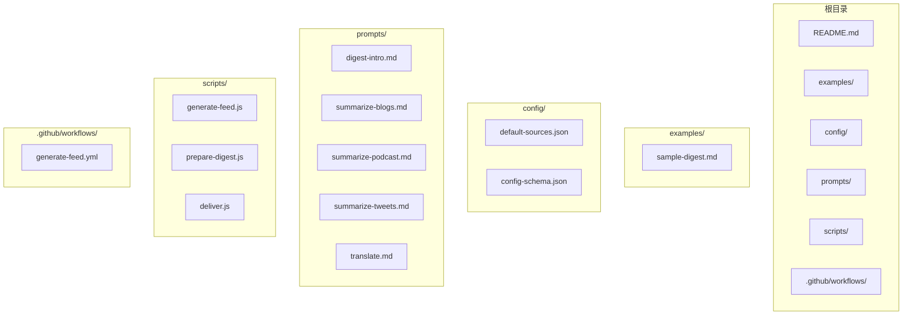
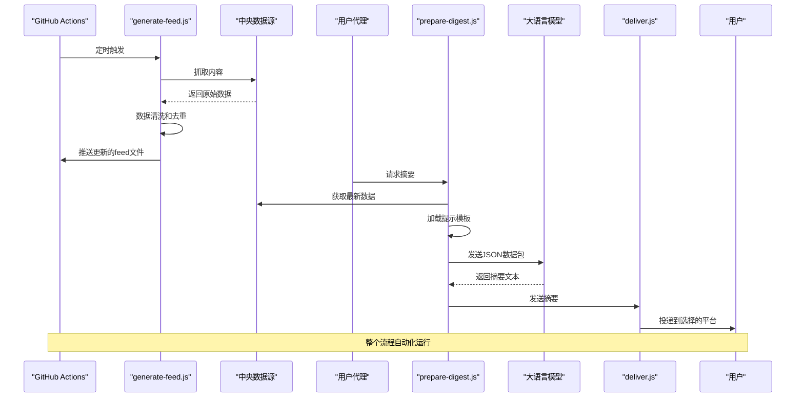
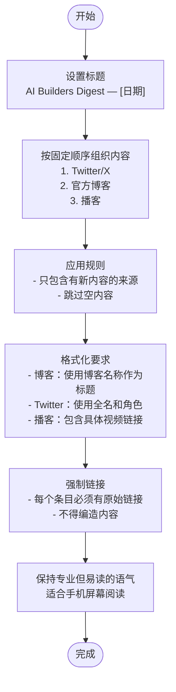
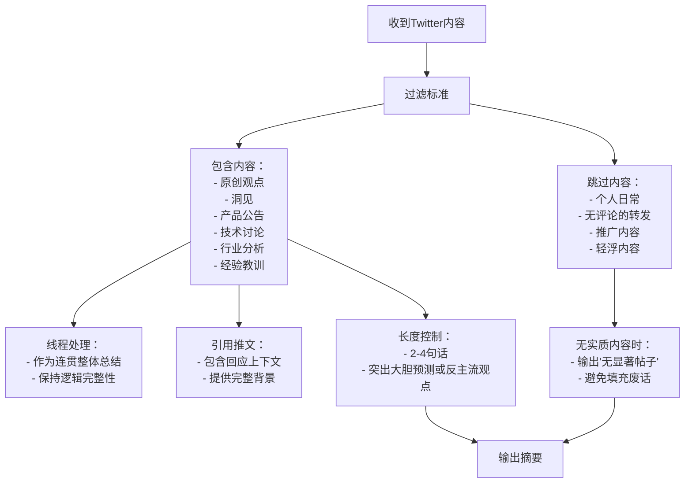
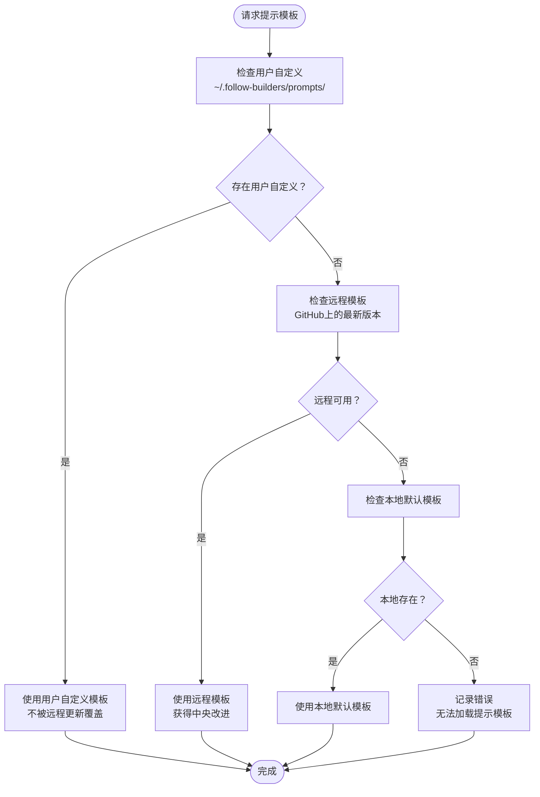
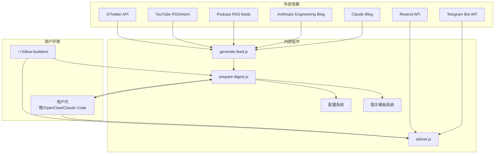

# 自定义与提示工程

<cite>
**本文档引用的文件**
- [README.md](file://README.md)
- [prompts/digest-intro.md](file://prompts/digest-intro.md)
- [prompts/summarize-blogs.md](file://prompts/summarize-blogs.md)
- [prompts/summarize-podcast.md](file://prompts/summarize-podcast.md)
- [prompts/summarize-tweets.md](file://prompts/summarize-tweets.md)
- [prompts/translate.md](file://prompts/translate.md)
- [scripts/prepare-digest.js](file://scripts/prepare-digest.js)
- [scripts/generate-feed.js](file://scripts/generate-feed.js)
- [scripts/deliver.js](file://scripts/deliver.js)
- [config/default-sources.json](file://config/default-sources.json)
- [config/config-schema.json](file://config/config-schema.json)
- [examples/sample-digest.md](file://examples/sample-digest.md)
- [.github/workflows/generate-feed.yml](file://.github/workflows/generate-feed.yml)
</cite>

## 目录
1. [简介](#简介)
2. [项目结构](#项目结构)
3. [核心组件](#核心组件)
4. [架构概览](#架构概览)
5. [详细组件分析](#详细组件分析)
6. [依赖关系分析](#依赖关系分析)
7. [性能考虑](#性能考虑)
8. [故障排除指南](#故障排除指南)
9. [结论](#结论)

## 简介

Follow Builders是一个AI驱动的摘要生成器，专注于追踪AI领域的顶级构建者（研究人员、创始人、产品经理和工程师），为他们发布的相关内容提供精选摘要。该项目的核心创新在于其基于提示工程的可定制化系统，允许用户通过简单的自然语言指令来调整摘要风格和内容呈现方式。

该项目采用"无API密钥"的设计理念，所有内容都从中央源获取，确保了部署的简便性和隐私保护。用户可以通过对话界面或直接编辑提示文件来自定义摘要行为。

## 项目结构

Follow Builders项目采用模块化的文件组织结构，主要包含以下核心目录：

**图表来源**
- [README.md:1-132](file://README.md#L1-L132)
- [prompts/digest-intro.md:1-60](file://prompts/digest-intro.md#L1-L60)
- [scripts/prepare-digest.js:1-166](file://scripts/prepare-digest.js#L1-L166)

**章节来源**
- [README.md:1-132](file://README.md#L1-L132)
- [config/default-sources.json:1-78](file://config/default-sources.json#L1-L78)

## 核心组件

Follow Builders系统由五个核心组件构成，每个组件都有其特定的功能和作用：

### 提示模板系统
- **digest-intro.md**: 控制摘要的整体格式和结构
- **summarize-blogs.md**: 处理博客文章的摘要生成
- **summarize-podcast.md**: 处理播客内容的重混和提炼
- **summarize-tweets.md**: 处理Twitter帖子的摘要生成
- **translate.md**: 处理中英文翻译和双语模式

### 数据处理管道
- **generate-feed.js**: 中央数据抓取和聚合脚本
- **prepare-digest.js**: 摘要准备和提示加载系统
- **deliver.js**: 多平台投递系统

### 配置管理系统
- **default-sources.json**: 默认内容源配置
- **config-schema.json**: 用户配置验证模式

**章节来源**
- [README.md:49-66](file://README.md#L49-L66)
- [prompts/digest-intro.md:1-60](file://prompts/digest-intro.md#L1-L60)
- [prompts/summarize-blogs.md:1-19](file://prompts/summarize-blogs.md#L1-L19)
- [prompts/summarize-podcast.md:1-18](file://prompts/summarize-podcast.md#L1-L18)
- [prompts/summarize-tweets.md:1-22](file://prompts/summarize-tweets.md#L1-L22)
- [prompts/translate.md:1-19](file://prompts/translate.md#L1-L19)

## 架构概览

Follow Builders采用分层架构设计，实现了数据获取、处理、生成和投递的完整流水线：

**图表来源**
- [.github/workflows/generate-feed.yml:1-54](file://.github/workflows/generate-feed.yml#L1-L54)
- [scripts/generate-feed.js:1-1100](file://scripts/generate-feed.js#L1-L1100)
- [scripts/prepare-digest.js:56-156](file://scripts/prepare-digest.js#L56-L156)

该架构的关键优势在于：
- **完全自动化**: 通过GitHub Actions实现每日自动更新
- **去中心化**: 所有内容从中央源获取，避免分散管理
- **可扩展性**: 模块化设计支持新内容类型的添加
- **隐私保护**: 不需要API密钥，保护用户隐私

## 详细组件分析

### 提示模板系统详解

#### 摘要介绍模板 (digest-intro.md)
这个模板负责控制整个摘要的最终格式和组织结构：

**图表来源**
- [prompts/digest-intro.md:17-60](file://prompts/digest-intro.md#L17-L60)

#### 博客摘要模板 (summarize-blogs.md)
针对技术博客文章的专门摘要策略：

| 关键要素 | 具体要求 | 目的 |
|---------|---------|------|
| 字数范围 | 100-300字 | 平衡信息密度和可读性 |
| 核心信息优先 | 首先呈现最重要的公告或洞察 | 帮助忙碌的专业人士快速获取要点 |
| 具体数据 | 包含具体数字、基准和结果 | 提供可验证的信息 |
| 引用要求 | 至少包含一个直接引文 | 确保信息准确性 |
| 实用性强调 | 明确指出实践影响（新API、新功能等） | 帮助读者理解实际价值 |

#### 播客摘要模板 (summarize-podcast.md)
播客内容的独特处理方式：

| 特殊要求 | 设计原理 | 实际效果 |
|---------|---------|---------|
| "要点总结"开头 | 快速建立预期，让读者知道重点 | 减少阅读负担 |
| 反直觉洞察优先 | 吸引注意力，提供独特价值 | 提高内容吸引力 |
| 具体引用 | 增强可信度和准确性 | 避免主观臆测 |
| 独立成篇 | 不依赖上下文引用 | 提高可分享性 |
| 通俗化表达 | 降低专业门槛 | 扩大受众范围 |

#### Twitter摘要模板 (summarize-tweets.md)
社交媒体内容的精炼策略：

**图表来源**
- [prompts/summarize-tweets.md:6-22](file://prompts/summarize-tweets.md#L6-L22)

#### 翻译模板 (translate.md)
多语言支持的专门设计：

| 翻译策略 | 实施细节 | 语言学考量 |
|---------|---------|-----------|
| 术语保留 | AI、LLM、GPU、API等技术术语保持英文 | 符合中文技术圈习惯 |
| 专有名词 | 人名、公司名、产品名保持英文 | 避免翻译歧义 |
| 格式保持 | 严格保持原文结构和格式 | 确保信息完整性 |
| 双语模式 | 英文段落后直接跟中文翻译 | 提供对比学习价值 |
| 语气调整 | 保持专业但口语化的语调 | 符合中文表达习惯 |

**章节来源**
- [prompts/digest-intro.md:1-60](file://prompts/digest-intro.md#L1-L60)
- [prompts/summarize-blogs.md:1-19](file://prompts/summarize-blogs.md#L1-L19)
- [prompts/summarize-podcast.md:1-18](file://prompts/summarize-podcast.md#L1-L18)
- [prompts/summarize-tweets.md:1-22](file://prompts/summarize-tweets.md#L1-L22)
- [prompts/translate.md:1-19](file://prompts/translate.md#L1-L19)

### 提示模板加载机制

Follow Builders实现了智能的提示模板加载系统，具有三层优先级：

**图表来源**
- [scripts/prepare-digest.js:86-121](file://scripts/prepare-digest.js#L86-L121)

这种设计确保了：
- **用户优先**: 用户的个性化修改永远优先
- **社区协作**: 默认模板可以持续改进
- **容错能力**: 多层回退机制保证系统稳定性

**章节来源**
- [scripts/prepare-digest.js:86-121](file://scripts/prepare-digest.js#L86-L121)

### 内容类型摘要策略差异

不同内容类型采用了差异化处理策略以最大化信息价值：

#### 技术深度 vs. 时效性
- **博客文章**: 注重深度分析和技术细节
- **播客内容**: 平衡深度和时效性，突出即时洞见
- **Twitter内容**: 强调实时性和行动导向

#### 信息密度控制
- **博客**: 允许更长的摘要以容纳复杂概念
- **播客**: 适度压缩以适应音频转文字的局限
- **Twitter**: 极致压缩，每句话都有明确价值

#### 交互方式差异
- **博客**: 提供深入的技术讨论和背景信息
- **播客**: 展现对话式思维和多角度分析
- **Twitter**: 直接、简洁、行动导向

**章节来源**
- [prompts/summarize-blogs.md:8-19](file://prompts/summarize-blogs.md#L8-L19)
- [prompts/summarize-podcast.md:8-18](file://prompts/summarize-podcast.md#L8-L18)
- [prompts/summarize-tweets.md:8-22](file://prompts/summarize-tweets.md#L8-L22)

## 依赖关系分析

Follow Builders系统的依赖关系体现了清晰的层次结构：

**图表来源**
- [scripts/generate-feed.js:20-37](file://scripts/generate-feed.js#L20-L37)
- [scripts/prepare-digest.js:26-40](file://scripts/prepare-digest.js#L26-L40)
- [scripts/deliver.js:23-34](file://scripts/deliver.js#L23-L34)

**章节来源**
- [scripts/generate-feed.js:20-37](file://scripts/generate-feed.js#L20-L37)
- [scripts/prepare-digest.js:26-40](file://scripts/prepare-digest.js#L26-L40)
- [scripts/deliver.js:23-34](file://scripts/deliver.js#L23-L34)

## 性能考虑

### 数据抓取优化
- **时间窗口限制**: 不同内容类型采用不同的抓取时间范围，平衡新鲜度和效率
- **去重机制**: 使用状态文件防止重复内容，减少处理开销
- **批量API调用**: Twitter API支持批量用户查询，提高效率

### 提示模板加载优化
- **缓存策略**: 用户自定义模板优先，避免不必要的网络请求
- **降级机制**: 多层回退确保系统稳定性
- **异步处理**: 并行获取多个数据源

### 输出优化
- **Telegram分片**: 超长摘要自动分割，避免4096字符限制
- **Markdown兼容**: 自动处理Telegram的Markdown解析问题
- **多平台适配**: 统一的输出格式支持多种投递方式

## 故障排除指南

### 常见问题及解决方案

#### 提示模板加载失败
**症状**: 摘要生成过程中出现提示模板缺失错误
**原因**: 用户自定义模板损坏或远程模板不可访问
**解决**: 
1. 检查 `~/.follow-builders/prompts/` 目录下的模板文件
2. 删除损坏的自定义模板，系统会自动回退到默认模板
3. 确认网络连接正常

#### 内容抓取失败
**症状**: 摘要中缺少某些内容源
**原因**: 外部API限制或网络问题
**解决**:
1. 检查API密钥配置（如果适用）
2. 等待一段时间后重试
3. 查看GitHub Actions日志了解具体错误

#### 投递失败
**症状**: 摘要无法发送到目标平台
**解决**:
1. 检查 `.env` 文件中的API密钥
2. 验证配置文件中的投递参数
3. 查看投递脚本的错误输出

**章节来源**
- [scripts/prepare-digest.js:159-165](file://scripts/prepare-digest.js#L159-L165)
- [scripts/deliver.js:166-214](file://scripts/deliver.js#L166-L214)

## 结论

Follow Builders项目展示了提示工程在实际应用中的强大威力。通过精心设计的提示模板系统，该项目实现了高度可定制化的摘要生成，同时保持了简单易用的用户体验。

### 核心优势

1. **可定制性强**: 用户可以通过简单的自然语言指令调整摘要风格
2. **维护成本低**: 基于提示工程的设计减少了代码维护需求
3. **扩展性好**: 新的内容类型和摘要策略可以轻松添加
4. **隐私保护**: 无需API密钥，保护用户隐私

### 最佳实践建议

1. **渐进式定制**: 从小处着手，逐步调整提示模板
2. **测试验证**: 每次修改后生成示例摘要进行验证
3. **备份策略**: 修改前备份原始提示模板
4. **社区贡献**: 将有用的模板改进贡献给社区

### 未来发展

随着AI技术的发展，Follow Builders的提示工程系统将继续演进，为用户提供更加智能化和个性化的摘要体验。通过持续的社区协作和技术创新，该项目有望成为AI内容消费领域的标杆解决方案。