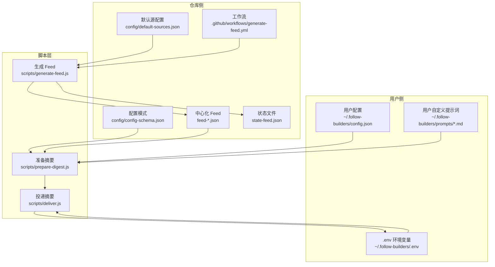
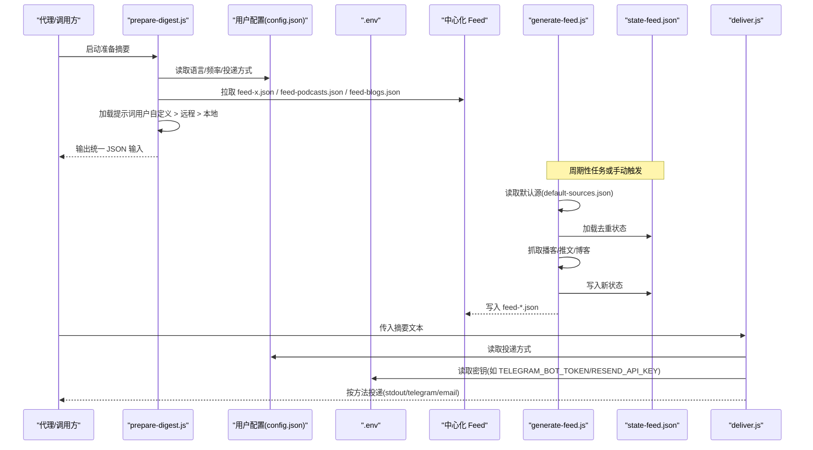
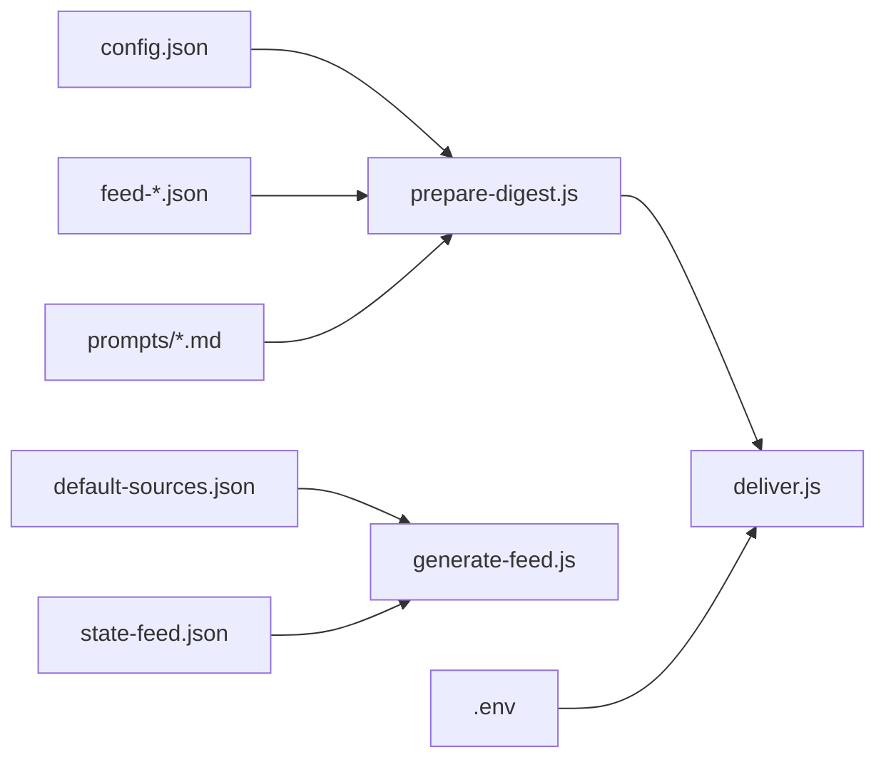

# 配置管理

<cite>
**本文引用的文件**
- [config-schema.json](file://config/config-schema.json)
- [default-sources.json](file://config/default-sources.json)
- [generate-feed.js](file://scripts/generate-feed.js)
- [deliver.js](file://scripts/deliver.js)
- [prepare-digest.js](file://scripts/prepare-digest.js)
- [package.json](file://scripts/package.json)
- [state-feed.json](file://state-feed.json)
- [generate-feed.yml](file://.github/workflows/generate-feed.yml)
- [README.md](file://README.md)
- [digest-intro.md](file://prompts/digest-intro.md)
- [summarize-podcast.md](file://prompts/summarize-podcast.md)
- [summarize-tweets.md](file://prompts/summarize-tweets.md)
- [summarize-blogs.md](file://prompts/summarize-blogs.md)
- [sample-digest.md](file://examples/sample-digest.md)
</cite>

## 目录
1. [简介](#简介)
2. [项目结构](#项目结构)
3. [核心组件](#核心组件)
4. [架构总览](#架构总览)
5. [详细组件分析](#详细组件分析)
6. [依赖关系分析](#依赖关系分析)
7. [性能考量](#性能考量)
8. [故障排查指南](#故障排查指南)
9. [结论](#结论)
10. [附录](#附录)

## 简介
本文件系统性阐述 Follow Builders 的配置管理系统，涵盖用户配置文件结构与作用、config-schema.json 的验证规则、default-sources.json 的默认源配置、环境变量管理、配置优先级与覆盖机制、配置示例与最佳实践、自定义内容源与摘要风格、交付偏好设置、安全与隐私保护，以及面向高级用户的扩展指导。

## 项目结构
Follow Builders 的配置管理由“用户配置”“默认源配置”“运行时脚本”“状态文件”“自动化工作流”等部分组成。用户配置位于用户主目录下的专用目录中；默认源配置在仓库内提供；运行时脚本负责读取配置、加载源、生成摘要、选择交付方式并发送；状态文件用于去重；GitHub Actions 负责周期性生成中心化 feed。

图表来源
- [generate-feed.js](file://scripts/generate-feed.js)
- [deliver.js](file://scripts/deliver.js)
- [prepare-digest.js](file://scripts/prepare-digest.js)
- [default-sources.json](file://config/default-sources.json)
- [config-schema.json](file://config/config-schema.json)
- [generate-feed.yml](file://.github/workflows/generate-feed.yml)
- [state-feed.json](file://state-feed.json)

章节来源
- [README.md](file://README.md)
- [generate-feed.js](file://scripts/generate-feed.js)
- [deliver.js](file://scripts/deliver.js)
- [prepare-digest.js](file://scripts/prepare-digest.js)

## 核心组件
- 用户配置（config.json）
  - 存放位置：用户主目录下专用目录，路径由脚本解析。
  - 关键字段：平台、语言、时区、频率、投递时间、每周几、投递方式与参数、引导完成标记。
  - 验证依据：config-schema.json 定义了类型、枚举值、默认值与描述。
- 默认源配置（default-sources.json）
  - 提供播客、博客、X 账号三类默认源列表，作为内容抓取的基础数据。
- 运行时脚本
  - 准备摘要：读取用户配置、拉取中心化 feed、加载提示词（优先级：用户自定义 > 远程 > 本地），输出统一输入给 LLM。
  - 生成 Feed：按默认源抓取内容，写入中心化 feed 并维护状态文件。
  - 投递摘要：根据配置选择 stdout/Telegram/Email，从 .env 读取密钥。
- 状态文件（state-feed.json）
  - 记录已见过的推文、视频、文章，避免重复投递。
- 自动化工作流
  - 按计划任务触发，注入 API 密钥，执行生成脚本并推送结果。

章节来源
- [config-schema.json](file://config/config-schema.json)
- [default-sources.json](file://config/default-sources.json)
- [prepare-digest.js](file://scripts/prepare-digest.js)
- [generate-feed.js](file://scripts/generate-feed.js)
- [deliver.js](file://scripts/deliver.js)
- [state-feed.json](file://state-feed.json)
- [generate-feed.yml](file://.github/workflows/generate-feed.yml)

## 架构总览
以下序列图展示“准备摘要 -> 生成 Feed -> 投递摘要”的端到端流程，以及配置与环境变量的使用点。

图表来源
- [prepare-digest.js](file://scripts/prepare-digest.js)
- [generate-feed.js](file://scripts/generate-feed.js)
- [deliver.js](file://scripts/deliver.js)
- [default-sources.json](file://config/default-sources.json)
- [state-feed.json](file://state-feed.json)

## 详细组件分析

### 用户配置文件结构与验证
- 存储位置与加载
  - 用户配置路径：脚本通过用户主目录拼接固定子目录定位。
  - 加载策略：若存在则读取并合并默认值；不存在则使用默认值。
- 字段说明与默认值
  - platform：检测平台（openclaw/other）。
  - language：语言（en/zh/bilingual，默认 en）。
  - timezone：时区字符串（默认美国洛杉矶）。
  - frequency：频率（daily/weekly，默认 daily）。
  - deliveryTime：每日投递时间（默认 08:00，24 小时制）。
  - weeklyDay：每周投递星期（默认周一）。
  - delivery.method：投递方式（stdout/telegram/email，默认 stdout）。
  - delivery.chatId：Telegram 聊天 ID（仅 telegram）。
  - delivery.email：邮箱地址（仅 email）。
  - onboardingComplete：是否完成初始设置（默认 false）。
- 验证规则
  - 类型与枚举：严格限制字段类型与可选值。
  - 默认值：未提供时自动填充。
  - 描述：字段具备清晰用途说明，便于用户理解。

章节来源
- [config-schema.json](file://config/config-schema.json)
- [prepare-digest.js](file://scripts/prepare-digest.js)
- [deliver.js](file://scripts/deliver.js)

### 默认源配置（default-sources.json）
- 结构
  - podcasts：播客数组，包含名称、RSS 地址、频道/播放列表 URL。
  - blogs：博客数组，包含名称、抓取类型、索引页 URL、文章基础 URL、抓取方法。
  - x_accounts：X/Twitter 账号数组，包含名称与用户名。
- 作用
  - 作为内容抓取的“白名单”，决定抓取范围与入口。
  - 中心化更新后，用户无需手动维护即可获得最新源。

章节来源
- [default-sources.json](file://config/default-sources.json)
- [generate-feed.js](file://scripts/generate-feed.js)

### 环境变量管理
- 位置
  - .env 文件位于用户配置目录，由投递脚本加载。
- 使用场景
  - Telegram：需要机器人令牌与聊天 ID。
  - Email：需要邮件服务 API 密钥与收件人邮箱。
- 安全建议
  - .env 仅存放投递所需的密钥，不上传至仓库。
  - 通过脚本显式读取，不在日志中打印。

章节来源
- [deliver.js](file://scripts/deliver.js)
- [package.json](file://scripts/package.json)

### 配置优先级与覆盖机制
- 提示词优先级（prepare-digest.js）
  - 用户自定义 > 远程（GitHub）> 本地默认。
  - 若用户已在用户目录自定义提示词，则优先使用，避免被远程更新覆盖。
- 用户配置优先级（prepare-digest.js）
  - 以用户配置为准；若缺失字段，采用 schema 默认值。
- 交付方式优先级（deliver.js）
  - 以 config.json 中 delivery.method 为准；若未指定，默认 stdout。
- 源覆盖（generate-feed.js）
  - 默认源来自仓库内的 default-sources.json；用户无法直接修改该文件。
  - 如需自定义源，请参考“自定义内容源”一节。

章节来源
- [prepare-digest.js](file://scripts/prepare-digest.js)
- [deliver.js](file://scripts/deliver.js)
- [config-schema.json](file://config/config-schema.json)
- [default-sources.json](file://config/default-sources.json)

### 配置示例与最佳实践
- 示例场景
  - 每周投递：将 frequency 设为 weekly，weeklyDay 设为合适日期，deliveryTime 设为期望时间。
  - 多语言：language 设为 zh 或 bilingual。
  - Telegram 投递：method 设为 telegram，并在 .env 中配置机器人令牌与 chatId。
  - 邮件投递：method 设为 email，并在 .env 中配置 API 密钥与邮箱。
- 最佳实践
  - 使用代理对话进行设置，避免手写配置文件。
  - 保持默认源不变，通过提示词定制摘要风格。
  - 将 .env 放在受控环境中，定期轮换密钥。

章节来源
- [README.md](file://README.md)
- [config-schema.json](file://config/config-schema.json)
- [deliver.js](file://scripts/deliver.js)

### 自定义内容源
- 默认源不可直接修改
  - default-sources.json 为只读默认集，用于中心化更新。
- 推荐做法
  - 通过代理对话添加关注对象或播客，由系统在后续版本中纳入默认源。
  - 对于临时需求，可在用户目录下维护自定义提示词，以影响摘要风格而非源列表。

章节来源
- [default-sources.json](file://config/default-sources.json)
- [README.md](file://README.md)

### 调整摘要风格
- 提示词优先级
  - 用户自定义提示词优先，确保个性化定制不会被远程更新覆盖。
- 可编辑提示词
  - 摘要播客：summarize-podcast.md
  - 摘要推文：summarize-tweets.md
  - 摘要博客：summarize-blogs.md
  - 汇总导言：digest-intro.md
  - 翻译：translate.md
- 示例参考
  - 输出样例可参考 examples/sample-digest.md。

章节来源
- [prepare-digest.js](file://scripts/prepare-digest.js)
- [digest-intro.md](file://prompts/digest-intro.md)
- [summarize-podcast.md](file://prompts/summarize-podcast.md)
- [summarize-tweets.md](file://prompts/summarize-tweets.md)
- [summarize-blogs.md](file://prompts/summarize-blogs.md)
- [sample-digest.md](file://examples/sample-digest.md)

### 配置交付偏好
- stdout：直接输出到终端/代理，适合本地调试与集成。
- telegram：需要 .env 中的机器人令牌与 chatId。
- email：需要 .env 中的邮件服务 API 密钥与收件人邮箱。

章节来源
- [deliver.js](file://scripts/deliver.js)
- [config-schema.json](file://config/config-schema.json)

### 安全与隐私
- 数据边界
  - 所有公开内容（博客、播客、推文）均来自公共渠道。
- 本地存储
  - 用户配置、提示词与 .env 仅保存在本地，不上传至仓库。
- 最小暴露
  - .env 仅包含投递所需密钥；不向外部发送任何配置信息。

章节来源
- [README.md](file://README.md)
- [deliver.js](file://scripts/deliver.js)

### 高级用户扩展
- 自定义提示词
  - 在用户目录 prompts 下新增或修改 .md 文件，遵循现有格式，即可影响摘要风格。
- 自定义投递
  - 当前支持 stdout/telegram/email；如需扩展，可在脚本中增加分支逻辑并补充 .env 键。
- 自定义源
  - 不建议直接修改 default-sources.json；可通过代理对话或社区反馈纳入默认源。

章节来源
- [prepare-digest.js](file://scripts/prepare-digest.js)
- [deliver.js](file://scripts/deliver.js)
- [default-sources.json](file://config/default-sources.json)

## 依赖关系分析
- 组件耦合
  - prepare-digest.js 依赖用户配置与远程 feed；提示词加载具有明确优先级。
  - generate-feed.js 依赖默认源与状态文件，产出中心化 feed。
  - deliver.js 依赖用户配置与 .env，实现多通道投递。
- 外部依赖
  - X/Twitter API、pod2txt、YouTube Atom/网页抓取、Resend 邮件 API。
- 循环依赖
  - 无循环依赖，数据单向流动：源 -> feed -> 摘要 -> 投递。

图表来源
- [prepare-digest.js](file://scripts/prepare-digest.js)
- [generate-feed.js](file://scripts/generate-feed.js)
- [deliver.js](file://scripts/deliver.js)
- [default-sources.json](file://config/default-sources.json)
- [state-feed.json](file://state-feed.json)

章节来源
- [prepare-digest.js](file://scripts/prepare-digest.js)
- [generate-feed.js](file://scripts/generate-feed.js)
- [deliver.js](file://scripts/deliver.js)

## 性能考量
- 去重与缓存
  - state-feed.json 记录已见内容，避免重复处理与投递。
- 抓取窗口
  - 不同源采用不同的回溯窗口，减少无效请求。
- 并发与限流
  - X API 分批查询用户 ID；对速率限制进行处理。
- I/O 优化
  - 读取与写入集中于脚本内部，尽量减少重复解析。

章节来源
- [generate-feed.js](file://scripts/generate-feed.js)
- [state-feed.json](file://state-feed.json)

## 故障排查指南
- 投递失败
  - 检查 .env 是否正确配置对应密钥与收件人。
  - Telegram：确认 chatId 有效且机器人已启动。
  - Email：确认 API 密钥可用且邮箱格式正确。
- 配置错误
  - 使用 config-schema.json 校验字段类型与枚举值。
  - 未提供字段将使用默认值，检查默认行为是否符合预期。
- 提示词问题
  - 确认用户自定义提示词存在且可读。
  - 远程提示词拉取失败时会回退到本地默认提示词。
- 内容为空
  - 检查中心化 feed 是否成功生成（工作流是否运行）。
  - 检查回溯窗口与去重状态是否导致过滤过多。

章节来源
- [deliver.js](file://scripts/deliver.js)
- [config-schema.json](file://config/config-schema.json)
- [prepare-digest.js](file://scripts/prepare-digest.js)
- [generate-feed.yml](file://.github/workflows/generate-feed.yml)

## 结论
Follow Builders 的配置管理以“用户配置 + 默认源 + 提示词优先级 + 状态去重 + 工作流自动化”为核心，既保证了易用性（通过代理对话完成设置），又提供了可扩展性（提示词与投递方式）。通过严格的验证规则与最小化敏感信息暴露，系统在功能与安全之间取得平衡。建议用户优先使用代理对话进行配置与定制，避免直接编辑底层文件，以获得更稳定的体验。

## 附录
- 配置字段速览
  - platform、language、timezone、frequency、deliveryTime、weeklyDay、delivery.method、delivery.chatId、delivery.email、onboardingComplete
- 提示词文件一览
  - summarize-podcast.md、summarize-tweets.md、summarize-blogs.md、digest-intro.md、translate.md
- 输出样例参考
  - examples/sample-digest.md