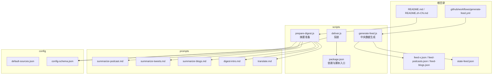
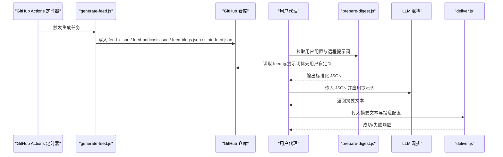
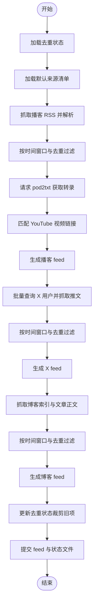
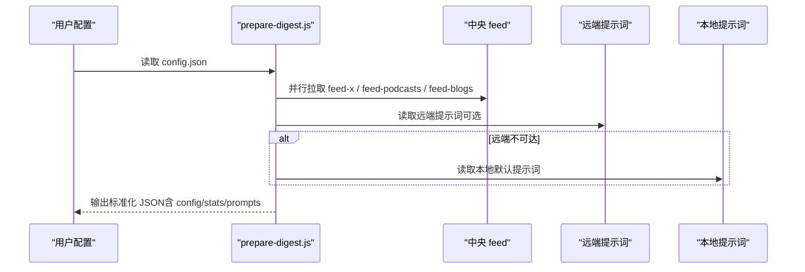
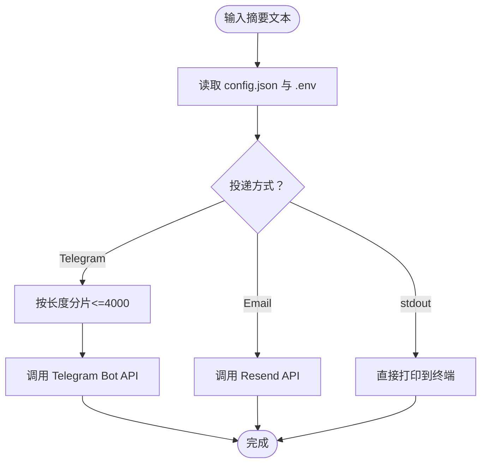
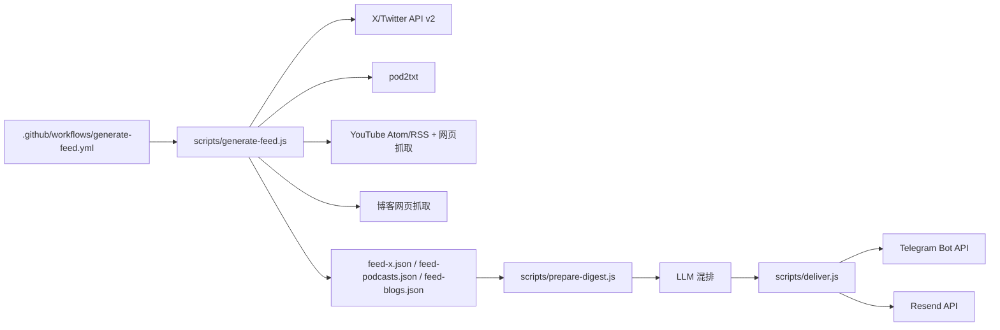

# 项目概述

<cite>
**本文引用的文件**
- [README.md](file://README.md)
- [README.zh-CN.md](file://README.zh-CN.md)
- [SKILL.md](file://SKILL.md)
- [config/default-sources.json](file://config/default-sources.json)
- [config/config-schema.json](file://config/config-schema.json)
- [.github/workflows/generate-feed.yml](file://.github/workflows/generate-feed.yml)
- [scripts/package.json](file://scripts/package.json)
- [scripts/generate-feed.js](file://scripts/generate-feed.js)
- [scripts/prepare-digest.js](file://scripts/prepare-digest.js)
- [scripts/deliver.js](file://scripts/deliver.js)
- [prompts/summarize-blogs.md](file://prompts/summarize-blogs.md)
- [prompts/summarize-podcast.md](file://prompts/summarize-podcast.md)
- [prompts/summarize-tweets.md](file://prompts/summarize-tweets.md)
- [prompts/digest-intro.md](file://prompts/digest-intro.md)
- [prompts/translate.md](file://prompts/translate.md)
</cite>

## 目录
1. [引言](#引言)
2. [项目结构](#项目结构)
3. [核心组件](#核心组件)
4. [架构总览](#架构总览)
5. [详细组件分析](#详细组件分析)
6. [依赖关系分析](#依赖关系分析)
7. [性能考量](#性能考量)
8. [故障排查指南](#故障排查指南)
9. [结论](#结论)
10. [附录](#附录)

## 引言
Follow Builders 的核心价值主张非常明确：在信息过载时代，帮助用户聚焦于“真正建造者”而非“意见搬运者”。项目通过 AI 驱动的自动化流程，将来自顶级 AI 建造者（研究人员、创始人、产品经理、工程师）的真实声音，转化为可读性强、直达要点的摘要，并按用户的偏好定时投递到其常用的即时通讯平台。

设计哲学强调“去噪音、重原创、强落地”：只抓取公开内容，不引入外部 API 密钥，确保隐私与易用；通过精心策划的提示词（prompt）控制摘要风格，既适合初学者快速浏览，也能满足专业读者对深度与细节的需求。

目标用户群体包括：
- 对 AI 行业动态敏感的从业者与研究者
- 希望高效获取高质量信息但无暇逐字阅读原文的忙碌专业人士
- 偏好定制化摘要风格与多语言支持的国际化用户

主要功能特性：
- 每日/每周定时摘要投递（Telegram、Discord、WhatsApp、邮件、或原地显示）
- 覆盖播客、X/Twitter、官方公司博客三大来源
- 多语言支持（英文、中文、中英双语）
- 通过对话式交互调整摘要长度、语气与偏好
- 无需 API 密钥即可使用（除投递渠道外）

章节来源
- [README.md:1-132](file://README.md#L1-L132)
- [README.zh-CN.md:1-122](file://README.zh-CN.md#L1-L122)
- [SKILL.md:1-467](file://SKILL.md#L1-L467)

## 项目结构
仓库采用“技能（Skill）+ 脚本 + 提示词 + 配置”的分层组织方式：
- 根目录提供用户文档与工作流
- scripts 目录包含三类脚本：中央数据生成、摘要准备、投递
- prompts 目录存放可定制的摘要与翻译提示词
- config 目录管理默认来源清单与用户配置模式
- feed-*.json 与 state-feed.json 由 GitHub Actions 定时生成并托管在仓库根目录

图示来源
- [.github/workflows/generate-feed.yml:1-54](file://.github/workflows/generate-feed.yml#L1-L54)
- [scripts/package.json:1-15](file://scripts/package.json#L1-L15)
- [scripts/generate-feed.js:1-1100](file://scripts/generate-feed.js#L1-L1100)
- [scripts/prepare-digest.js:1-166](file://scripts/prepare-digest.js#L1-L166)
- [scripts/deliver.js:1-218](file://scripts/deliver.js#L1-L218)
- [config/default-sources.json:1-78](file://config/default-sources.json#L1-L78)
- [config/config-schema.json:1-66](file://config/config-schema.json#L1-L66)

章节来源
- [.github/workflows/generate-feed.yml:1-54](file://.github/workflows/generate-feed.yml#L1-L54)
- [scripts/package.json:1-15](file://scripts/package.json#L1-L15)
- [config/default-sources.json:1-78](file://config/default-sources.json#L1-L78)
- [config/config-schema.json:1-66](file://config/config-schema.json#L1-L66)

## 核心组件
- 中央数据生成器（generate-feed.js）
  - 从 RSS/官方 API/网页抓取等渠道采集播客、X/Twitter、博客内容
  - 基于时间窗口与去重状态文件过滤新增内容
  - 输出 feed-x.json、feed-podcasts.json、feed-blogs.json 与 state-feed.json
- 摘要准备器（prepare-digest.js）
  - 读取用户配置，拉取中央 feed 与提示词
  - 合并统计信息与提示词优先级（用户自定义 > 远端中心 > 本地默认）
  - 输出标准化 JSON 供 LLM 混排
- 投递器（deliver.js）
  - 支持 Telegram、邮件（Resend）、stdout 三种投递方式
  - 自动处理长消息分片、Markdown 渲染回退、错误报告
- 提示词体系（prompts/*.md）
  - podcast/tweets/blogs 的摘要风格与要点约束
  - digest-intro 的整体结构与链接规范
  - translate 的中英互译与双语交错规则
- 用户配置与默认来源
  - config/config-schema.json 定义用户配置字段与默认值
  - config/default-sources.json 列出默认播客、博客与 X 账号

章节来源
- [scripts/generate-feed.js:1-1100](file://scripts/generate-feed.js#L1-L1100)
- [scripts/prepare-digest.js:1-166](file://scripts/prepare-digest.js#L1-L166)
- [scripts/deliver.js:1-218](file://scripts/deliver.js#L1-L218)
- [prompts/summarize-blogs.md:1-19](file://prompts/summarize-blogs.md#L1-L19)
- [prompts/summarize-podcast.md:1-18](file://prompts/summarize-podcast.md#L1-L18)
- [prompts/summarize-tweets.md:1-22](file://prompts/summarize-tweets.md#L1-L22)
- [prompts/digest-intro.md:1-60](file://prompts/digest-intro.md#L1-L60)
- [prompts/translate.md:1-19](file://prompts/translate.md#L1-L19)
- [config/config-schema.json:1-66](file://config/config-schema.json#L1-L66)
- [config/default-sources.json:1-78](file://config/default-sources.json#L1-L78)

## 架构总览
Follow Builders 的运行分为“中央生成 + 本地消费”两段式：
- 中央生成阶段：由 GitHub Actions 定时触发 generate-feed.js，抓取并去重，产出三个 feed 与状态文件
- 本地消费阶段：用户代理调用 prepare-digest.js 拉取 feed 与提示词，LLM 依据提示词混排摘要；随后 deliver.js 按配置投递

图示来源
- [.github/workflows/generate-feed.yml:1-54](file://.github/workflows/generate-feed.yml#L1-L54)
- [scripts/generate-feed.js:1-1100](file://scripts/generate-feed.js#L1-L1100)
- [scripts/prepare-digest.js:1-166](file://scripts/prepare-digest.js#L1-L166)
- [scripts/deliver.js:1-218](file://scripts/deliver.js#L1-L218)

## 详细组件分析

### 组件A：中央数据生成器（generate-feed.js）
职责与流程
- 加载默认来源清单与去重状态
- 分别抓取播客（RSS + pod2txt）、X/Twitter（官方 API v2）、博客（网页抓取）
- 基于时间窗口与去重策略筛选候选内容，解析并匹配 YouTube 视频链接
- 生成三个 feed 与状态文件，提交到仓库

关键实现点
- 时间窗口与上限：播客/推文/博客分别设定不同的回溯窗口与每源最大条数，避免重复与噪声
- 去重机制：基于 state-feed.json 记录最近 7 天的已见 ID，防止跨运行重复推送
- 容错与重试：pod2txt 采用轮询等待就绪，网络异常与解析失败记录错误但不中断
- YouTube 匹配：优先 Atom RSS，失败则回退到 /videos 页面抓取，标题归一化后进行相似度匹配

图示来源
- [scripts/generate-feed.js:1-1100](file://scripts/generate-feed.js#L1-L1100)
- [config/default-sources.json:1-78](file://config/default-sources.json#L1-L78)

章节来源
- [scripts/generate-feed.js:1-1100](file://scripts/generate-feed.js#L1-L1100)
- [config/default-sources.json:1-78](file://config/default-sources.json#L1-L78)

### 组件B：摘要准备器（prepare-digest.js）
职责与流程
- 读取用户配置（语言、频率、投递方式等）
- 并行拉取三个 feed 与提示词
- 合并统计信息与提示词优先级（用户自定义 > 远端中心 > 本地默认）
- 输出统一 JSON，供 LLM 严格遵循提示词进行混排

提示词优先级策略
- 用户自定义：若 ~/.follow-builders/prompts/ 存在个性化文件，则优先使用
- 远端中心：若网络可达，优先使用 GitHub 上的最新提示词
- 本地默认：作为最终兜底，保证离线可用

图示来源
- [scripts/prepare-digest.js:1-166](file://scripts/prepare-digest.js#L1-L166)
- [config/config-schema.json:1-66](file://config/config-schema.json#L1-L66)

章节来源
- [scripts/prepare-digest.js:1-166](file://scripts/prepare-digest.js#L1-L166)
- [config/config-schema.json:1-66](file://config/config-schema.json#L1-L66)

### 组件C：投递器（deliver.js）
职责与流程
- 从 stdin、参数或文件读取摘要文本
- 根据配置选择投递方式：Telegram（分片 + Markdown 回退）、Resend 邮件、stdout
- 输出结构化结果（成功/失败/跳过），便于上游脚本或代理记录

投递细节
- Telegram：4096 字符限制分片，遇到 Markdown 解析错误自动降级
- 邮件：使用 Resend API，主题包含日期，正文为纯文本
- stdout：直接输出，交由代理或 OpenClaw 管理通道

图示来源
- [scripts/deliver.js:1-218](file://scripts/deliver.js#L1-L218)

章节来源
- [scripts/deliver.js:1-218](file://scripts/deliver.js#L1-L218)

### 组件D：提示词体系（prompts/*.md）
- summarize-podcast.md：强调“单点收获”“反直觉洞察”“可迁移经验”，避免泛泛而谈
- summarize-tweets.md：聚焦“实质性内容”，限定作者身份表达，禁止刷屏与营销
- summarize-blogs.md：突出“关键公告/发现/结论”，保留具体数据与实践建议
- digest-intro.md：统一结构、强制链接、禁止虚构内容
- translate.md：中英互译与双语交错规则，保持技术术语一致性

章节来源
- [prompts/summarize-blogs.md:1-19](file://prompts/summarize-blogs.md#L1-L19)
- [prompts/summarize-podcast.md:1-18](file://prompts/summarize-podcast.md#L1-L18)
- [prompts/summarize-tweets.md:1-22](file://prompts/summarize-tweets.md#L1-L22)
- [prompts/digest-intro.md:1-60](file://prompts/digest-intro.md#L1-L60)
- [prompts/translate.md:1-19](file://prompts/translate.md#L1-L19)

### 组件E：用户配置与默认来源
- config-schema.json：定义平台、语言、时区、频率、投递方式、是否完成引导等字段
- default-sources.json：默认播客、博客与 X 账号清单，由中央统一维护与更新

章节来源
- [config/config-schema.json:1-66](file://config/config-schema.json#L1-L66)
- [config/default-sources.json:1-78](file://config/default-sources.json#L1-L78)

## 依赖关系分析
- 脚本依赖
  - scripts/package.json 声明 dotenv 与 proper-lockfile，用于环境变量加载与锁文件管理
- 外部服务
  - X/Twitter API v2：用户批量查询与推文抓取
  - pod2txt：播客转录服务（异步轮询）
  - YouTube：Atom RSS 与网页抓取回退
  - Resend：邮件投递
  - Telegram Bot API：消息投递
- 工作流
  - .github/workflows/generate-feed.yml：每日 UTC 6:17 定时运行，支持手动触发与按模块选择

图示来源
- [.github/workflows/generate-feed.yml:1-54](file://.github/workflows/generate-feed.yml#L1-L54)
- [scripts/generate-feed.js:1-1100](file://scripts/generate-feed.js#L1-L1100)
- [scripts/prepare-digest.js:1-166](file://scripts/prepare-digest.js#L1-L166)
- [scripts/deliver.js:1-218](file://scripts/deliver.js#L1-L218)

章节来源
- [.github/workflows/generate-feed.yml:1-54](file://.github/workflows/generate-feed.yml#L1-L54)
- [scripts/package.json:1-15](file://scripts/package.json#L1-L15)

## 性能考量
- 并行抓取：prepare-digest.js 对三个 feed 采用 Promise.all 并行拉取，减少等待时间
- 去重与裁剪：state-feed.json 定期清理 7 天前条目，避免无限增长
- 限流与容错：X API 速率限制时提前中断后续账户抓取；pod2txt 轮询最多 5 次，超时给出明确错误
- 文本长度控制：Telegram 分片与 Markdown 回退保障投递稳定性
- 本地优先：提示词优先使用用户自定义版本，避免每次网络拉取

## 故障排查指南
常见问题与定位思路
- 无法获取 feed
  - 检查网络连通性与 GitHub 仓库访问权限
  - 查看 prepare-digest.js 输出的错误数组
- 提示词未更新
  - 确认网络可达且 GitHub 上存在对应文件
  - 若远端不可达，将回退到本地默认提示词
- Telegram 投递失败
  - 检查 .env 是否包含 TELEGRAM_BOT_TOKEN 与 chatId 是否正确
  - 关注 Telegram API 错误描述，必要时关闭 Markdown 解析
- 邮件投递失败
  - 检查 .env 中 RESEND_API_KEY 与收件邮箱
  - 确认 Resend API 返回的错误信息
- X API 速率限制
  - 观察 generate-feed.js 日志中的 429 错误，适当降低抓取频率或增加延时
- 博客抓取失败
  - 网站结构变化可能导致解析失败，回退到备用解析策略或检查站点可访问性

章节来源
- [scripts/prepare-digest.js:1-166](file://scripts/prepare-digest.js#L1-L166)
- [scripts/deliver.js:1-218](file://scripts/deliver.js#L1-L218)
- [scripts/generate-feed.js:1-1100](file://scripts/generate-feed.js#L1-L1100)

## 结论
Follow Builders 以“建造者视角”为核心，结合中心化数据生成与本地化 LLM 混排，构建了一个低门槛、高价值、可定制的 AI 行业摘要系统。其设计在隐私保护、易用性与可扩展性之间取得平衡：用户无需 API 密钥即可享受高质量内容；通过对话即可调整摘要风格；通过提示词即可持续优化输出质量。对于初学者，项目提供了开箱即用的默认配置与清晰的引导流程；对于有经验的开发者，项目以纯文本提示词与模块化脚本形式，提供了充分的定制空间与集成可能。

## 附录
- 实际使用场景示例
  - 新手入门：安装技能后通过对话完成首次设置，选择每日推送与 Telegram 投递，立即收到首期摘要
  - 专业读者：调整摘要长度与语气，开启中英双语模式，定期接收播客与博客的要点提炼
  - 团队协作：在 OpenClaw 中配置多通道投递，按周汇总并分享给团队成员
- 最佳实践
  - 优先使用用户自定义提示词，避免被中心更新覆盖
  - 定期检查投递配置与网络状态，确保定时任务正常运行
  - 对于播客与博客内容，建议结合原文链接深入阅读